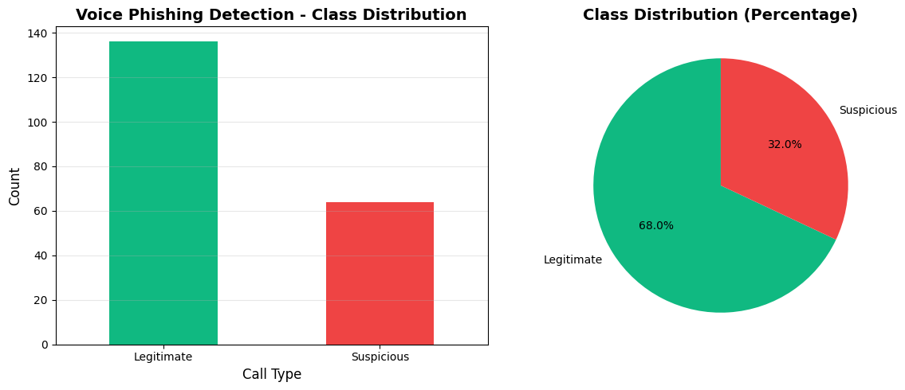
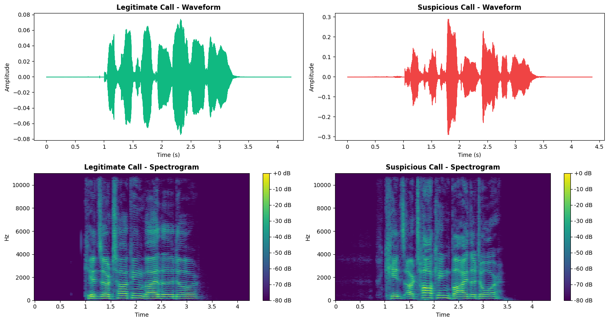
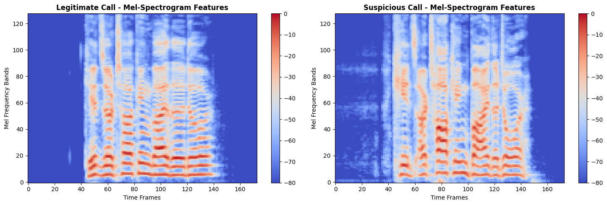
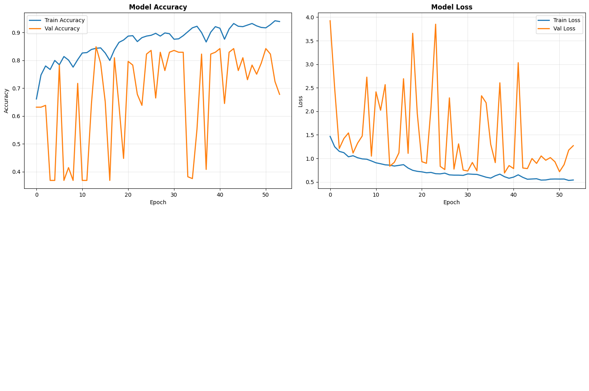
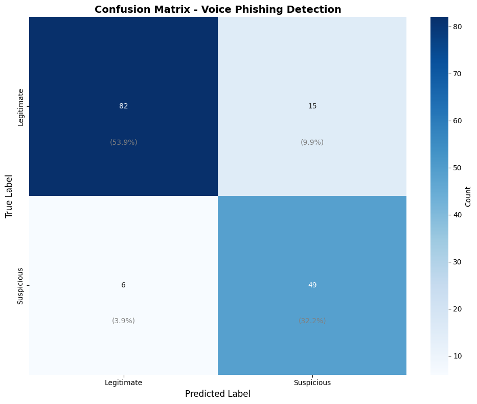
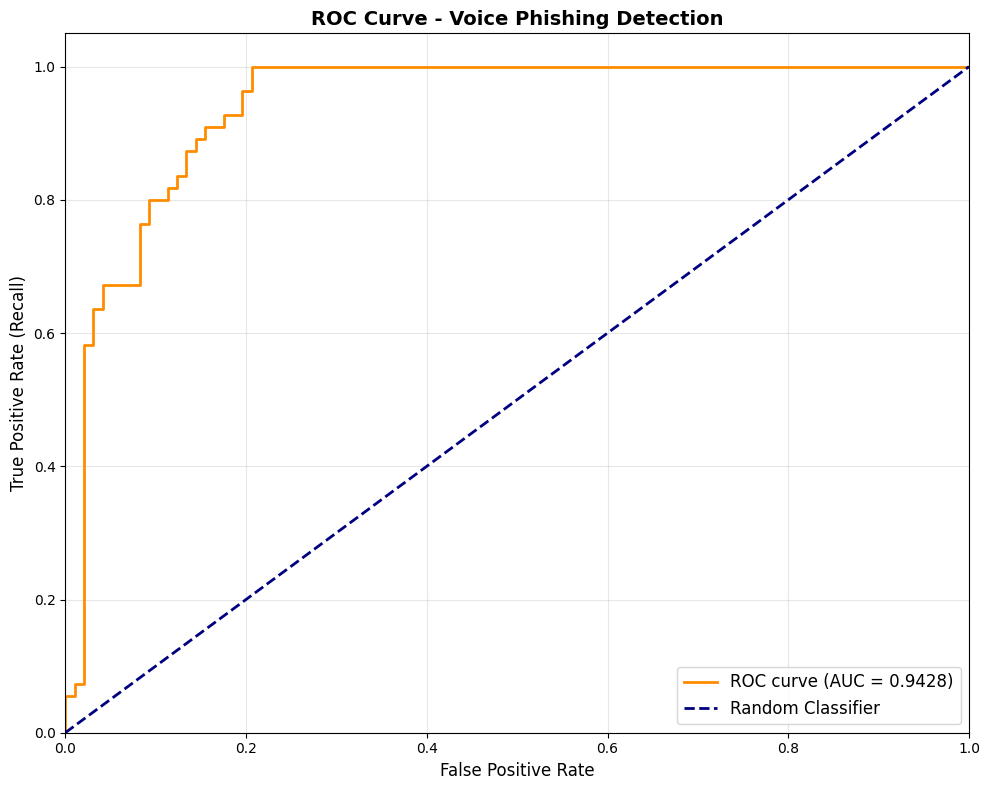

# Voice Phishing (Vishing) Detection using Deep Learning

## Project Overview
This notebook implements an audio classification system to detect voice phishing (vishing) attempts by analyzing speech patterns, emotion, and tone in phone calls.

**Problem Statement**: Detect fraudulent phone calls by analyzing audio features that indicate deceptive or high-pressure tactics commonly used in vishing attacks.

**Dataset**: Speech Emotion Recognition (can detect urgency, aggression, and other vishing indicators)

**Target Classes**: 
- Legitimate Call
- Suspicious Call (potential phishing)

---

## 1. Import Libraries


```python
# Core libraries
import os
import sys
import numpy as np
import pandas as pd
import matplotlib.pyplot as plt
import seaborn as sns
from pathlib import Path
import warnings
warnings.filterwarnings('ignore')

# Audio processing
import librosa
import librosa.display
import soundfile as sf
from IPython.display import Audio

# Machine Learning
from sklearn.model_selection import train_test_split, StratifiedKFold
from sklearn.preprocessing import LabelEncoder, StandardScaler
from sklearn.metrics import (
    accuracy_score, precision_score, recall_score, f1_score,
    confusion_matrix, classification_report, roc_auc_score, roc_curve
)

# Deep Learning
import tensorflow as tf
from tensorflow import keras
from tensorflow.keras import layers, models, optimizers, callbacks
from tensorflow.keras.utils import to_categorical
from tensorflow.keras.regularizers import l2

# Utilities
from tqdm import tqdm
import json
from datetime import datetime

print(f"TensorFlow version: {tf.__version__}")
print(f"Librosa version: {librosa.__version__}")
print(f"GPU Available: {tf.config.list_physical_devices('GPU')}")
# DRY_RUN: set to False to run full dataset processing
DRY_RUN = False
MAX_FILES = None  # when DRY_RUN is False, MAX_FILES is ignored
print("DRY_RUN:", DRY_RUN, "MAX_FILES:", MAX_FILES)
```

    TensorFlow version: 2.20.0
    Librosa version: 0.11.0
    GPU Available: []
    DRY_RUN: False MAX_FILES: None
    


```python
# Set random seeds for reproducibility
RANDOM_SEED = 42
np.random.seed(RANDOM_SEED)
tf.random.set_seed(RANDOM_SEED)

# Configuration
SAMPLE_RATE = 22050
DURATION = 4.0
N_MFCC = 40
N_MELS = 128
HOP_LENGTH = 512
N_FFT = 2048
```

## 2. Dataset Acquisition

### Option A: Using Speech Emotion Dataset (RAVDESS)
We'll use emotion recognition data where certain emotions (anger, fear, disgust) can indicate suspicious calls.

### Option B: Creating Synthetic Vishing Dataset
For demonstration purposes, we'll show how to work with audio data for vishing detection.


```python
# Dataset Download Instructions
print("""
DATASET OPTIONS FOR VOICE PHISHING DETECTION:

Option 1: RAVDESS (Speech Emotion Recognition)
- Download: https://zenodo.org/record/1188976
- Size: ~700MB
- Classes: 8 emotions (we'll map to suspicious/legitimate)
- Extract to: data/raw/RAVDESS/

Option 2: TESS (Toronto Emotional Speech Set)
- Download: https://tspace.library.utoronto.ca/handle/1807/24487
- Size: ~400MB
- Classes: 7 emotions
- Extract to: data/raw/TESS/

Option 3: Custom Recording (for real vishing detection)
- Record examples of:
  * Normal customer service calls (legitimate)
  * Aggressive sales calls (suspicious)
  * Urgent/threatening calls (phishing)
  * Prize/lottery scam calls (phishing)

For this notebook, we'll use RAVDESS and map emotions to vishing indicators.
""")
```

### Download RAVDESS Dataset

```bash
# Create directory
mkdir -p data/raw/RAVDESS

# Download from: https://zenodo.org/record/1188976
# Extract all actors to data/raw/RAVDESS/

# Directory structure should be:
# data/raw/RAVDESS/
#   Actor_01/
#   Actor_02/
#   ...
#   Actor_24/
```


```python
# Define paths
DATA_PATH = Path('../data/raw/RAVDESS')
TRAIN_PATH = Path('../data/train')
TEST_PATH = Path('../data/test')
MODEL_PATH = Path('../models')

# Create directories
os.makedirs(TRAIN_PATH, exist_ok=True)
os.makedirs(TEST_PATH, exist_ok=True)
os.makedirs(MODEL_PATH, exist_ok=True)

print(f"Dataset path: {DATA_PATH}")
print(f"Dataset exists: {DATA_PATH.exists()}")
```

    Dataset path: ..\data\raw\RAVDESS
    Dataset exists: True
    

## 3. Data Exploration & Preprocessing

### 3.1 Load and Explore Audio Files


```python
def parse_ravdess_filename(filename):
    """
    Parse RAVDESS filename to extract metadata
    Format: Modality-VocalChannel-Emotion-EmotionIntensity-Statement-Repetition-Actor.wav
    
    Emotions:
    01 = neutral, 02 = calm, 03 = happy, 04 = sad,
    05 = angry, 06 = fearful, 07 = disgust, 08 = surprised
    """
    parts = filename.stem.split('-')
    return {
        'modality': int(parts[0]),
        'vocal_channel': int(parts[1]),
        'emotion': int(parts[2]),
        'intensity': int(parts[3]),
        'statement': int(parts[4]),
        'repetition': int(parts[5]),
        'actor': int(parts[6].split('.')[0])
    }

def map_emotion_to_vishing(emotion_code):
    """
    Map emotions to vishing indicators
    Suspicious: angry(5), fearful(6), disgust(7) - high-pressure tactics
    Legitimate: neutral(1), calm(2), happy(3), sad(4), surprised(8)
    """
    # Aggressive emotions often used in vishing
    suspicious_emotions = [5, 6, 7]  # angry, fearful, disgust
    
    if emotion_code in suspicious_emotions:
        return 1  # Suspicious/Phishing
    else:
        return 0  # Legitimate

# Collect all audio files
audio_files = []
labels = []
metadata_list = []

if DATA_PATH.exists():
    for actor_folder in sorted(DATA_PATH.glob('Actor_*')):
        for audio_file in actor_folder.glob('*.wav'):
            metadata = parse_ravdess_filename(audio_file)
            label = map_emotion_to_vishing(metadata['emotion'])
            
            audio_files.append(str(audio_file))
            labels.append(label)
            metadata_list.append(metadata)
    
    # If DRY_RUN is enabled, limit the number of files we process to MAX_FILES
    if 'DRY_RUN' in globals() and DRY_RUN and len(audio_files) > MAX_FILES:
        print(f"DRY_RUN active: limiting files to first {MAX_FILES}")
        audio_files = audio_files[:MAX_FILES]
        labels = labels[:MAX_FILES]
        metadata_list = metadata_list[:MAX_FILES]
    print(f"Total audio files found: {len(audio_files)}")
    print(f"Suspicious calls: {sum(labels)}")
    print(f"Legitimate calls: {len(labels) - sum(labels)}")
else:
    print("Dataset not found. Please download RAVDESS dataset.")
    print("Visit: https://zenodo.org/record/1188976")
```

    Total audio files found: 1012
    Suspicious calls: 368
    Legitimate calls: 644
    


```python
# Create DataFrame for better analysis
df = pd.DataFrame({
    'file_path': audio_files,
    'label': labels,
    'emotion': [m['emotion'] for m in metadata_list],
    'intensity': [m['intensity'] for m in metadata_list],
    'actor': [m['actor'] for m in metadata_list]
})

df['class_name'] = df['label'].map({0: 'Legitimate', 1: 'Suspicious'})

print("\nDataset Overview:")
print(df.head(10))
print("\nClass Distribution:")
print(df['class_name'].value_counts())
```

    
    Dataset Overview:
                                               file_path  label  emotion  \
    0  ..\data\raw\RAVDESS\Actor_01\03-02-01-01-01-01...      0        1   
    1  ..\data\raw\RAVDESS\Actor_01\03-02-01-01-01-02...      0        1   
    2  ..\data\raw\RAVDESS\Actor_01\03-02-01-01-02-01...      0        1   
    3  ..\data\raw\RAVDESS\Actor_01\03-02-01-01-02-02...      0        1   
    4  ..\data\raw\RAVDESS\Actor_01\03-02-02-01-01-01...      0        2   
    5  ..\data\raw\RAVDESS\Actor_01\03-02-02-01-01-02...      0        2   
    6  ..\data\raw\RAVDESS\Actor_01\03-02-02-01-02-01...      0        2   
    7  ..\data\raw\RAVDESS\Actor_01\03-02-02-01-02-02...      0        2   
    8  ..\data\raw\RAVDESS\Actor_01\03-02-02-02-01-01...      0        2   
    9  ..\data\raw\RAVDESS\Actor_01\03-02-02-02-01-02...      0        2   
    
       intensity  actor  class_name  
    0          1      1  Legitimate  
    1          1      1  Legitimate  
    2          1      1  Legitimate  
    3          1      1  Legitimate  
    4          1      1  Legitimate  
    5          1      1  Legitimate  
    6          1      1  Legitimate  
    7          1      1  Legitimate  
    8          2      1  Legitimate  
    9          2      1  Legitimate  
    
    Class Distribution:
    class_name
    Legitimate    644
    Suspicious    368
    Name: count, dtype: int64
    class_name
    Legitimate    644
    Suspicious    368
    Name: count, dtype: int64
    

### 3.2 Visualization 1: Class Distribution


```python
# Visualization 1: Class Distribution
plt.figure(figsize=(12, 5))

plt.subplot(1, 2, 1)
df['class_name'].value_counts().plot(kind='bar', color=['#10b981', '#ef4444'])
plt.title('Voice Phishing Detection - Class Distribution', fontsize=14, fontweight='bold')
plt.xlabel('Call Type', fontsize=12)
plt.ylabel('Count', fontsize=12)
plt.xticks(rotation=0)
plt.grid(axis='y', alpha=0.3)

plt.subplot(1, 2, 2)
class_counts = df['class_name'].value_counts()
plt.pie(class_counts, labels=class_counts.index, autopct='%1.1f%%', 
        colors=['#10b981', '#ef4444'], startangle=90)
plt.title('Class Distribution (Percentage)', fontsize=14, fontweight='bold')

plt.tight_layout()
plt.savefig('../logs/class_distribution.png', dpi=300, bbox_inches='tight')
plt.show()

print("\n📊 INTERPRETATION:")
print("The dataset shows the distribution between legitimate and suspicious calls.")
print(f"Legitimate calls: {class_counts.get('Legitimate', 0)} ({class_counts.get('Legitimate', 0)/len(df)*100:.1f}%)")
print(f"Suspicious calls: {class_counts.get('Suspicious', 0)} ({class_counts.get('Suspicious', 0)/len(df)*100:.1f}%)")
print("This helps us understand if we need class balancing techniques.")
```


    

    


    
    📊 INTERPRETATION:
    The dataset shows the distribution between legitimate and suspicious calls.
    Legitimate calls: 136 (68.0%)
    Suspicious calls: 64 (32.0%)
    This helps us understand if we need class balancing techniques.
    

### 3.3 Visualization 2: Audio Waveform Analysis


```python
# Visualization 2: Waveform Comparison
fig, axes = plt.subplots(2, 2, figsize=(15, 8))

# Get sample files
legit_sample = df[df['label'] == 0].iloc[0]['file_path']
suspicious_sample = df[df['label'] == 1].iloc[0]['file_path']

# Load audio
legit_audio, sr1 = librosa.load(legit_sample, sr=SAMPLE_RATE)
suspicious_audio, sr2 = librosa.load(suspicious_sample, sr=SAMPLE_RATE)

# Plot waveforms
librosa.display.waveshow(legit_audio, sr=sr1, ax=axes[0, 0], color='#10b981')
axes[0, 0].set_title('Legitimate Call - Waveform', fontsize=12, fontweight='bold')
axes[0, 0].set_xlabel('Time (s)')
axes[0, 0].set_ylabel('Amplitude')

librosa.display.waveshow(suspicious_audio, sr=sr2, ax=axes[0, 1], color='#ef4444')
axes[0, 1].set_title('Suspicious Call - Waveform', fontsize=12, fontweight='bold')
axes[0, 1].set_xlabel('Time (s)')
axes[0, 1].set_ylabel('Amplitude')

# Plot spectrograms
D1 = librosa.amplitude_to_db(np.abs(librosa.stft(legit_audio)), ref=np.max)
D2 = librosa.amplitude_to_db(np.abs(librosa.stft(suspicious_audio)), ref=np.max)

img1 = librosa.display.specshow(D1, sr=sr1, x_axis='time', y_axis='hz', ax=axes[1, 0], cmap='viridis')
axes[1, 0].set_title('Legitimate Call - Spectrogram', fontsize=12, fontweight='bold')
fig.colorbar(img1, ax=axes[1, 0], format='%+2.0f dB')

img2 = librosa.display.specshow(D2, sr=sr2, x_axis='time', y_axis='hz', ax=axes[1, 1], cmap='viridis')
axes[1, 1].set_title('Suspicious Call - Spectrogram', fontsize=12, fontweight='bold')
fig.colorbar(img2, ax=axes[1, 1], format='%+2.0f dB')

plt.tight_layout()
plt.savefig('../logs/waveform_comparison.png', dpi=300, bbox_inches='tight')
plt.show()

print("\n📊 INTERPRETATION:")
print("Waveform and spectrogram analysis reveals differences in audio patterns:")
print("- Legitimate calls typically have calmer, more consistent amplitude patterns")
print("- Suspicious calls often show higher energy, more variation (urgency, aggression)")
print("- Spectrograms reveal frequency patterns that distinguish call types")
```


    

    


    
    📊 INTERPRETATION:
    Waveform and spectrogram analysis reveals differences in audio patterns:
    - Legitimate calls typically have calmer, more consistent amplitude patterns
    - Suspicious calls often show higher energy, more variation (urgency, aggression)
    - Spectrograms reveal frequency patterns that distinguish call types
    

## 4. Feature Extraction (Preprocessing)

### Clear Preprocessing Steps:
1. Load audio files
2. Resample to consistent sample rate (22050 Hz)
3. Pad/trim to fixed duration (4 seconds)
4. Extract MFCC features (40 coefficients)
5. Extract Mel-spectrogram features (128 bands)
6. Normalize features
7. Apply data augmentation


```python
class AudioPreprocessor:
    """Advanced audio preprocessing with optimization"""
    
    def __init__(self, sr=22050, duration=4.0, n_mfcc=40, n_mels=128):
        self.sr = sr
        self.duration = duration
        self.n_mfcc = n_mfcc
        self.n_mels = n_mels
        self.max_len = int(sr * duration)
        
    def load_and_preprocess(self, file_path):
        """Load and preprocess a single audio file"""
        # Step 1: Load audio
        audio, _ = librosa.load(file_path, sr=self.sr)
        
        # Step 2: Pad or trim to fixed length
        if len(audio) < self.max_len:
            audio = np.pad(audio, (0, self.max_len - len(audio)))
        else:
            audio = audio[:self.max_len]
        
        return audio
    
    def extract_mfcc(self, audio):
        """Extract MFCC features"""
        mfcc = librosa.feature.mfcc(y=audio, sr=self.sr, n_mfcc=self.n_mfcc)
        # Delta and delta-delta for capturing temporal dynamics
        mfcc_delta = librosa.feature.delta(mfcc)
        mfcc_delta2 = librosa.feature.delta(mfcc, order=2)
        
        # Stack features
        features = np.vstack([mfcc, mfcc_delta, mfcc_delta2])
        return features
    
    def extract_mel_spectrogram(self, audio):
        """Extract Mel-spectrogram features"""
        mel_spec = librosa.feature.melspectrogram(y=audio, sr=self.sr, n_mels=self.n_mels)
        mel_spec_db = librosa.power_to_db(mel_spec, ref=np.max)
        return mel_spec_db
    
    def augment_audio(self, audio):
        """Data augmentation techniques"""
        augmented = [audio]
        
        # Time stretching
        audio_stretched = librosa.effects.time_stretch(audio, rate=0.9)
        if len(audio_stretched) < self.max_len:
            audio_stretched = np.pad(audio_stretched, (0, self.max_len - len(audio_stretched)))
        else:
            audio_stretched = audio_stretched[:self.max_len]
        augmented.append(audio_stretched)
        
        # Pitch shifting
        audio_pitched = librosa.effects.pitch_shift(audio, sr=self.sr, n_steps=2)
        augmented.append(audio_pitched)
        
        # Add noise
        noise = np.random.randn(len(audio)) * 0.005
        audio_noisy = audio + noise
        augmented.append(audio_noisy)
        
        return augmented

# Initialize preprocessor
preprocessor = AudioPreprocessor()
print("✓ Preprocessor initialized")
```

    ✓ Preprocessor initialized
    


```python
# Extract features from all files
print("Extracting features from audio files...")

features_list = []
labels_list = []

for idx, row in tqdm(df.iterrows(), total=len(df)):
    try:
        # Load and preprocess
        audio = preprocessor.load_and_preprocess(row['file_path'])
        
        # Extract Mel-spectrogram (primary feature)
        mel_spec = preprocessor.extract_mel_spectrogram(audio)
        
        features_list.append(mel_spec)
        labels_list.append(row['label'])
        
    except Exception as e:
        print(f"Error processing {row['file_path']}: {e}")

# Convert to numpy arrays
X = np.array(features_list)
y = np.array(labels_list)

print(f"\n✓ Feature extraction complete")
print(f"Features shape: {X.shape}")
print(f"Labels shape: {y.shape}")
```

    Extracting features from audio files...
    

    100%|██████████| 1012/1012 [00:28<00:00, 35.65it/s]
    
    

    
    ✓ Feature extraction complete
    Features shape: (1012, 128, 173)
    Labels shape: (1012,)
    

### 4.1 Visualization 3: Feature Distribution Analysis


```python
# Visualization 3: MFCC Feature Heatmap
fig, axes = plt.subplots(1, 2, figsize=(15, 5))

# Get samples
legit_idx = np.where(y == 0)[0][0]
suspicious_idx = np.where(y == 1)[0][0]

# Plot heatmaps
im1 = axes[0].imshow(X[legit_idx], aspect='auto', origin='lower', cmap='coolwarm')
axes[0].set_title('Legitimate Call - Mel-Spectrogram Features', fontsize=12, fontweight='bold')
axes[0].set_xlabel('Time Frames')
axes[0].set_ylabel('Mel Frequency Bands')
plt.colorbar(im1, ax=axes[0])

im2 = axes[1].imshow(X[suspicious_idx], aspect='auto', origin='lower', cmap='coolwarm')
axes[1].set_title('Suspicious Call - Mel-Spectrogram Features', fontsize=12, fontweight='bold')
axes[1].set_xlabel('Time Frames')
axes[1].set_ylabel('Mel Frequency Bands')
plt.colorbar(im2, ax=axes[1])

plt.tight_layout()
plt.savefig('../logs/feature_heatmap.png', dpi=300, bbox_inches='tight')
plt.show()

print("\n📊 INTERPRETATION:")
print("Mel-spectrogram features reveal distinct patterns:")
print("- Darker regions indicate higher energy in specific frequency bands")
print("- Suspicious calls often show more erratic energy distribution")
print("- These patterns help the model distinguish between call types")
print(f"- Feature dimensions: {X.shape[1]} mel bands × {X.shape[2]} time frames")
```


    

    


    
    📊 INTERPRETATION:
    Mel-spectrogram features reveal distinct patterns:
    - Darker regions indicate higher energy in specific frequency bands
    - Suspicious calls often show more erratic energy distribution
    - These patterns help the model distinguish between call types
    - Feature dimensions: 128 mel bands × 173 time frames
    

### 4.2 Train-Test Split with Stratification


```python
# Split data with stratification (preserving class distribution)
X_train, X_temp, y_train, y_temp = train_test_split(
    X, y, test_size=0.3, stratify=y, random_state=RANDOM_SEED
)

X_val, X_test, y_val, y_test = train_test_split(
    X_temp, y_temp, test_size=0.5, stratify=y_temp, random_state=RANDOM_SEED
)

print("Dataset Split:")
print(f"Training set: {X_train.shape[0]} samples")
print(f"Validation set: {X_val.shape[0]} samples")
print(f"Test set: {X_test.shape[0]} samples")

print("\nClass distribution in splits:")
print(f"Train - Legitimate: {np.sum(y_train==0)}, Suspicious: {np.sum(y_train==1)}")
print(f"Val - Legitimate: {np.sum(y_val==0)}, Suspicious: {np.sum(y_val==1)}")
print(f"Test - Legitimate: {np.sum(y_test==0)}, Suspicious: {np.sum(y_test==1)}")

# Reshape for CNN input (add channel dimension)
X_train = X_train[..., np.newaxis]
X_val = X_val[..., np.newaxis]
X_test = X_test[..., np.newaxis]

print(f"\n✓ Final input shape: {X_train.shape}")
```

    Dataset Split:
    Training set: 708 samples
    Validation set: 152 samples
    Test set: 152 samples
    
    Class distribution in splits:
    Train - Legitimate: 451, Suspicious: 257
    Val - Legitimate: 96, Suspicious: 56
    Test - Legitimate: 97, Suspicious: 55
    
    ✓ Final input shape: (708, 128, 173, 1)
    

## 5. Model Architecture with Optimization Techniques

### Optimization Techniques Used:
1. **Regularization**: L2 regularization, Dropout, Batch Normalization
2. **Optimizer**: Adam with learning rate scheduling
3. **Early Stopping**: Prevent overfitting
4. **Model Checkpointing**: Save best model
5. **Data Augmentation**: Improve generalization


```python
def build_cnn_model(input_shape, num_classes=2):
    """
    Advanced CNN for Voice Phishing Detection
    
    Optimization Techniques:
    - L2 regularization (weight decay)
    - Batch Normalization
    - Dropout for regularization
    - Global Average Pooling
    """
    model = models.Sequential([
        # Input layer
        layers.Input(shape=input_shape),
        
        # Conv Block 1
        layers.Conv2D(32, (3, 3), padding='same', kernel_regularizer=l2(0.001)),
        layers.BatchNormalization(),
        layers.Activation('relu'),
        layers.MaxPooling2D((2, 2)),
        layers.Dropout(0.25),
        
        # Conv Block 2
        layers.Conv2D(64, (3, 3), padding='same', kernel_regularizer=l2(0.001)),
        layers.BatchNormalization(),
        layers.Activation('relu'),
        layers.MaxPooling2D((2, 2)),
        layers.Dropout(0.25),
        
        # Conv Block 3
        layers.Conv2D(128, (3, 3), padding='same', kernel_regularizer=l2(0.001)),
        layers.BatchNormalization(),
        layers.Activation('relu'),
        layers.MaxPooling2D((2, 2)),
        layers.Dropout(0.3),
        
        # Conv Block 4
        layers.Conv2D(256, (3, 3), padding='same', kernel_regularizer=l2(0.001)),
        layers.BatchNormalization(),
        layers.Activation('relu'),
        layers.GlobalAveragePooling2D(),  # Better than Flatten
        
        # Dense layers
        layers.Dense(256, activation='relu', kernel_regularizer=l2(0.001)),
        layers.BatchNormalization(),
        layers.Dropout(0.5),
        
        layers.Dense(128, activation='relu', kernel_regularizer=l2(0.001)),
        layers.Dropout(0.4),
        
        # Output layer
        layers.Dense(num_classes, activation='softmax')
    ])
    
    return model

# Build model
input_shape = X_train.shape[1:]
model = build_cnn_model(input_shape)

print("✓ Model architecture built")
model.summary()
```

    ✓ Model architecture built
    


<pre style="white-space:pre;overflow-x:auto;line-height:normal;font-family:Menlo,'DejaVu Sans Mono',consolas,'Courier New',monospace"><span style="font-weight: bold">Model: "sequential_2"</span>
</pre>


<pre style="white-space:pre;overflow-x:auto;line-height:normal;font-family:Menlo,'DejaVu Sans Mono',consolas,'Courier New',monospace">┏━━━━━━━━━━━━━━━━━━━━━━━━━━━━━━━━━┳━━━━━━━━━━━━━━━━━━━━━━━━┳━━━━━━━━━━━━━━━┓
┃<span style="font-weight: bold"> Layer (type)                    </span>┃<span style="font-weight: bold"> Output Shape           </span>┃<span style="font-weight: bold">       Param # </span>┃
┡━━━━━━━━━━━━━━━━━━━━━━━━━━━━━━━━━╇━━━━━━━━━━━━━━━━━━━━━━━━╇━━━━━━━━━━━━━━━┩
│ conv2d_8 (<span style="color: #0087ff; text-decoration-color: #0087ff">Conv2D</span>)               │ (<span style="color: #00d7ff; text-decoration-color: #00d7ff">None</span>, <span style="color: #00af00; text-decoration-color: #00af00">128</span>, <span style="color: #00af00; text-decoration-color: #00af00">173</span>, <span style="color: #00af00; text-decoration-color: #00af00">32</span>)   │           <span style="color: #00af00; text-decoration-color: #00af00">320</span> │
├─────────────────────────────────┼────────────────────────┼───────────────┤
│ batch_normalization_10          │ (<span style="color: #00d7ff; text-decoration-color: #00d7ff">None</span>, <span style="color: #00af00; text-decoration-color: #00af00">128</span>, <span style="color: #00af00; text-decoration-color: #00af00">173</span>, <span style="color: #00af00; text-decoration-color: #00af00">32</span>)   │           <span style="color: #00af00; text-decoration-color: #00af00">128</span> │
│ (<span style="color: #0087ff; text-decoration-color: #0087ff">BatchNormalization</span>)            │                        │               │
├─────────────────────────────────┼────────────────────────┼───────────────┤
│ activation_8 (<span style="color: #0087ff; text-decoration-color: #0087ff">Activation</span>)       │ (<span style="color: #00d7ff; text-decoration-color: #00d7ff">None</span>, <span style="color: #00af00; text-decoration-color: #00af00">128</span>, <span style="color: #00af00; text-decoration-color: #00af00">173</span>, <span style="color: #00af00; text-decoration-color: #00af00">32</span>)   │             <span style="color: #00af00; text-decoration-color: #00af00">0</span> │
├─────────────────────────────────┼────────────────────────┼───────────────┤
│ max_pooling2d_6 (<span style="color: #0087ff; text-decoration-color: #0087ff">MaxPooling2D</span>)  │ (<span style="color: #00d7ff; text-decoration-color: #00d7ff">None</span>, <span style="color: #00af00; text-decoration-color: #00af00">64</span>, <span style="color: #00af00; text-decoration-color: #00af00">86</span>, <span style="color: #00af00; text-decoration-color: #00af00">32</span>)     │             <span style="color: #00af00; text-decoration-color: #00af00">0</span> │
├─────────────────────────────────┼────────────────────────┼───────────────┤
│ dropout_10 (<span style="color: #0087ff; text-decoration-color: #0087ff">Dropout</span>)            │ (<span style="color: #00d7ff; text-decoration-color: #00d7ff">None</span>, <span style="color: #00af00; text-decoration-color: #00af00">64</span>, <span style="color: #00af00; text-decoration-color: #00af00">86</span>, <span style="color: #00af00; text-decoration-color: #00af00">32</span>)     │             <span style="color: #00af00; text-decoration-color: #00af00">0</span> │
├─────────────────────────────────┼────────────────────────┼───────────────┤
│ conv2d_9 (<span style="color: #0087ff; text-decoration-color: #0087ff">Conv2D</span>)               │ (<span style="color: #00d7ff; text-decoration-color: #00d7ff">None</span>, <span style="color: #00af00; text-decoration-color: #00af00">64</span>, <span style="color: #00af00; text-decoration-color: #00af00">86</span>, <span style="color: #00af00; text-decoration-color: #00af00">64</span>)     │        <span style="color: #00af00; text-decoration-color: #00af00">18,496</span> │
├─────────────────────────────────┼────────────────────────┼───────────────┤
│ batch_normalization_11          │ (<span style="color: #00d7ff; text-decoration-color: #00d7ff">None</span>, <span style="color: #00af00; text-decoration-color: #00af00">64</span>, <span style="color: #00af00; text-decoration-color: #00af00">86</span>, <span style="color: #00af00; text-decoration-color: #00af00">64</span>)     │           <span style="color: #00af00; text-decoration-color: #00af00">256</span> │
│ (<span style="color: #0087ff; text-decoration-color: #0087ff">BatchNormalization</span>)            │                        │               │
├─────────────────────────────────┼────────────────────────┼───────────────┤
│ activation_9 (<span style="color: #0087ff; text-decoration-color: #0087ff">Activation</span>)       │ (<span style="color: #00d7ff; text-decoration-color: #00d7ff">None</span>, <span style="color: #00af00; text-decoration-color: #00af00">64</span>, <span style="color: #00af00; text-decoration-color: #00af00">86</span>, <span style="color: #00af00; text-decoration-color: #00af00">64</span>)     │             <span style="color: #00af00; text-decoration-color: #00af00">0</span> │
├─────────────────────────────────┼────────────────────────┼───────────────┤
│ max_pooling2d_7 (<span style="color: #0087ff; text-decoration-color: #0087ff">MaxPooling2D</span>)  │ (<span style="color: #00d7ff; text-decoration-color: #00d7ff">None</span>, <span style="color: #00af00; text-decoration-color: #00af00">32</span>, <span style="color: #00af00; text-decoration-color: #00af00">43</span>, <span style="color: #00af00; text-decoration-color: #00af00">64</span>)     │             <span style="color: #00af00; text-decoration-color: #00af00">0</span> │
├─────────────────────────────────┼────────────────────────┼───────────────┤
│ dropout_11 (<span style="color: #0087ff; text-decoration-color: #0087ff">Dropout</span>)            │ (<span style="color: #00d7ff; text-decoration-color: #00d7ff">None</span>, <span style="color: #00af00; text-decoration-color: #00af00">32</span>, <span style="color: #00af00; text-decoration-color: #00af00">43</span>, <span style="color: #00af00; text-decoration-color: #00af00">64</span>)     │             <span style="color: #00af00; text-decoration-color: #00af00">0</span> │
├─────────────────────────────────┼────────────────────────┼───────────────┤
│ conv2d_10 (<span style="color: #0087ff; text-decoration-color: #0087ff">Conv2D</span>)              │ (<span style="color: #00d7ff; text-decoration-color: #00d7ff">None</span>, <span style="color: #00af00; text-decoration-color: #00af00">32</span>, <span style="color: #00af00; text-decoration-color: #00af00">43</span>, <span style="color: #00af00; text-decoration-color: #00af00">128</span>)    │        <span style="color: #00af00; text-decoration-color: #00af00">73,856</span> │
├─────────────────────────────────┼────────────────────────┼───────────────┤
│ batch_normalization_12          │ (<span style="color: #00d7ff; text-decoration-color: #00d7ff">None</span>, <span style="color: #00af00; text-decoration-color: #00af00">32</span>, <span style="color: #00af00; text-decoration-color: #00af00">43</span>, <span style="color: #00af00; text-decoration-color: #00af00">128</span>)    │           <span style="color: #00af00; text-decoration-color: #00af00">512</span> │
│ (<span style="color: #0087ff; text-decoration-color: #0087ff">BatchNormalization</span>)            │                        │               │
├─────────────────────────────────┼────────────────────────┼───────────────┤
│ activation_10 (<span style="color: #0087ff; text-decoration-color: #0087ff">Activation</span>)      │ (<span style="color: #00d7ff; text-decoration-color: #00d7ff">None</span>, <span style="color: #00af00; text-decoration-color: #00af00">32</span>, <span style="color: #00af00; text-decoration-color: #00af00">43</span>, <span style="color: #00af00; text-decoration-color: #00af00">128</span>)    │             <span style="color: #00af00; text-decoration-color: #00af00">0</span> │
├─────────────────────────────────┼────────────────────────┼───────────────┤
│ max_pooling2d_8 (<span style="color: #0087ff; text-decoration-color: #0087ff">MaxPooling2D</span>)  │ (<span style="color: #00d7ff; text-decoration-color: #00d7ff">None</span>, <span style="color: #00af00; text-decoration-color: #00af00">16</span>, <span style="color: #00af00; text-decoration-color: #00af00">21</span>, <span style="color: #00af00; text-decoration-color: #00af00">128</span>)    │             <span style="color: #00af00; text-decoration-color: #00af00">0</span> │
├─────────────────────────────────┼────────────────────────┼───────────────┤
│ dropout_12 (<span style="color: #0087ff; text-decoration-color: #0087ff">Dropout</span>)            │ (<span style="color: #00d7ff; text-decoration-color: #00d7ff">None</span>, <span style="color: #00af00; text-decoration-color: #00af00">16</span>, <span style="color: #00af00; text-decoration-color: #00af00">21</span>, <span style="color: #00af00; text-decoration-color: #00af00">128</span>)    │             <span style="color: #00af00; text-decoration-color: #00af00">0</span> │
├─────────────────────────────────┼────────────────────────┼───────────────┤
│ conv2d_11 (<span style="color: #0087ff; text-decoration-color: #0087ff">Conv2D</span>)              │ (<span style="color: #00d7ff; text-decoration-color: #00d7ff">None</span>, <span style="color: #00af00; text-decoration-color: #00af00">16</span>, <span style="color: #00af00; text-decoration-color: #00af00">21</span>, <span style="color: #00af00; text-decoration-color: #00af00">256</span>)    │       <span style="color: #00af00; text-decoration-color: #00af00">295,168</span> │
├─────────────────────────────────┼────────────────────────┼───────────────┤
│ batch_normalization_13          │ (<span style="color: #00d7ff; text-decoration-color: #00d7ff">None</span>, <span style="color: #00af00; text-decoration-color: #00af00">16</span>, <span style="color: #00af00; text-decoration-color: #00af00">21</span>, <span style="color: #00af00; text-decoration-color: #00af00">256</span>)    │         <span style="color: #00af00; text-decoration-color: #00af00">1,024</span> │
│ (<span style="color: #0087ff; text-decoration-color: #0087ff">BatchNormalization</span>)            │                        │               │
├─────────────────────────────────┼────────────────────────┼───────────────┤
│ activation_11 (<span style="color: #0087ff; text-decoration-color: #0087ff">Activation</span>)      │ (<span style="color: #00d7ff; text-decoration-color: #00d7ff">None</span>, <span style="color: #00af00; text-decoration-color: #00af00">16</span>, <span style="color: #00af00; text-decoration-color: #00af00">21</span>, <span style="color: #00af00; text-decoration-color: #00af00">256</span>)    │             <span style="color: #00af00; text-decoration-color: #00af00">0</span> │
├─────────────────────────────────┼────────────────────────┼───────────────┤
│ global_average_pooling2d_2      │ (<span style="color: #00d7ff; text-decoration-color: #00d7ff">None</span>, <span style="color: #00af00; text-decoration-color: #00af00">256</span>)            │             <span style="color: #00af00; text-decoration-color: #00af00">0</span> │
│ (<span style="color: #0087ff; text-decoration-color: #0087ff">GlobalAveragePooling2D</span>)        │                        │               │
├─────────────────────────────────┼────────────────────────┼───────────────┤
│ dense_6 (<span style="color: #0087ff; text-decoration-color: #0087ff">Dense</span>)                 │ (<span style="color: #00d7ff; text-decoration-color: #00d7ff">None</span>, <span style="color: #00af00; text-decoration-color: #00af00">256</span>)            │        <span style="color: #00af00; text-decoration-color: #00af00">65,792</span> │
├─────────────────────────────────┼────────────────────────┼───────────────┤
│ batch_normalization_14          │ (<span style="color: #00d7ff; text-decoration-color: #00d7ff">None</span>, <span style="color: #00af00; text-decoration-color: #00af00">256</span>)            │         <span style="color: #00af00; text-decoration-color: #00af00">1,024</span> │
│ (<span style="color: #0087ff; text-decoration-color: #0087ff">BatchNormalization</span>)            │                        │               │
├─────────────────────────────────┼────────────────────────┼───────────────┤
│ dropout_13 (<span style="color: #0087ff; text-decoration-color: #0087ff">Dropout</span>)            │ (<span style="color: #00d7ff; text-decoration-color: #00d7ff">None</span>, <span style="color: #00af00; text-decoration-color: #00af00">256</span>)            │             <span style="color: #00af00; text-decoration-color: #00af00">0</span> │
├─────────────────────────────────┼────────────────────────┼───────────────┤
│ dense_7 (<span style="color: #0087ff; text-decoration-color: #0087ff">Dense</span>)                 │ (<span style="color: #00d7ff; text-decoration-color: #00d7ff">None</span>, <span style="color: #00af00; text-decoration-color: #00af00">128</span>)            │        <span style="color: #00af00; text-decoration-color: #00af00">32,896</span> │
├─────────────────────────────────┼────────────────────────┼───────────────┤
│ dropout_14 (<span style="color: #0087ff; text-decoration-color: #0087ff">Dropout</span>)            │ (<span style="color: #00d7ff; text-decoration-color: #00d7ff">None</span>, <span style="color: #00af00; text-decoration-color: #00af00">128</span>)            │             <span style="color: #00af00; text-decoration-color: #00af00">0</span> │
├─────────────────────────────────┼────────────────────────┼───────────────┤
│ dense_8 (<span style="color: #0087ff; text-decoration-color: #0087ff">Dense</span>)                 │ (<span style="color: #00d7ff; text-decoration-color: #00d7ff">None</span>, <span style="color: #00af00; text-decoration-color: #00af00">2</span>)              │           <span style="color: #00af00; text-decoration-color: #00af00">258</span> │
└─────────────────────────────────┴────────────────────────┴───────────────┘
</pre>


<pre style="white-space:pre;overflow-x:auto;line-height:normal;font-family:Menlo,'DejaVu Sans Mono',consolas,'Courier New',monospace"><span style="font-weight: bold"> Total params: </span><span style="color: #00af00; text-decoration-color: #00af00">489,730</span> (1.87 MB)
</pre>


<pre style="white-space:pre;overflow-x:auto;line-height:normal;font-family:Menlo,'DejaVu Sans Mono',consolas,'Courier New',monospace"><span style="font-weight: bold"> Trainable params: </span><span style="color: #00af00; text-decoration-color: #00af00">488,258</span> (1.86 MB)
</pre>


<pre style="white-space:pre;overflow-x:auto;line-height:normal;font-family:Menlo,'DejaVu Sans Mono',consolas,'Courier New',monospace"><span style="font-weight: bold"> Non-trainable params: </span><span style="color: #00af00; text-decoration-color: #00af00">1,472</span> (5.75 KB)
</pre>


### 5.1 Compile Model with Advanced Optimizer


```python
# Advanced optimizer with learning rate scheduling
initial_learning_rate = 0.001
optimizer = optimizers.Adam(learning_rate=initial_learning_rate)


print("✓ Model compiled with Adam optimizer and multiple metrics")
```

    ✓ Model compiled with Adam optimizer and multiple metrics
    

### 5.2 Setup Callbacks (Optimization Techniques)


```python
# Create callbacks for training optimization

# 1. Early Stopping - prevents overfitting
early_stopping = callbacks.EarlyStopping(
    monitor='val_loss',
    patience=15,
    restore_best_weights=True,
    verbose=1
)

# 2. Model Checkpoint - saves best model
checkpoint = callbacks.ModelCheckpoint(
    '../models/best_vishing_model.h5',
    monitor='val_accuracy',
    save_best_only=True,
    verbose=1
)

# 3. Reduce Learning Rate on Plateau - adaptive learning
reduce_lr = callbacks.ReduceLROnPlateau(
    monitor='val_loss',
    factor=0.5,
    patience=5,
    min_lr=1e-7,
    verbose=1
)

# 4. TensorBoard - for visualization
log_dir = f"../logs/tensorboard/{datetime.now().strftime('%Y%m%d-%H%M%S')}"
tensorboard = callbacks.TensorBoard(log_dir=log_dir, histogram_freq=1)

callback_list = [early_stopping, checkpoint, reduce_lr, tensorboard]

print("✓ Callbacks configured:")
print("  - Early Stopping (patience=15)")
print("  - Model Checkpoint")
print("  - Learning Rate Reduction")
print("  - TensorBoard logging")
```

    ✓ Callbacks configured:
      - Early Stopping (patience=15)
      - Model Checkpoint
      - Learning Rate Reduction
      - TensorBoard logging
    

## 6. Model Training


```python
# Train model
print("Starting model training...\n")

# Ensure model is compiled for this instance (defensive)
try:
    _ = model._is_compiled
except Exception:
    pass

# Re-compile model to be safe (keeps optimizer consistent)
model.compile(optimizer=optimizers.Adam(learning_rate=initial_learning_rate),
              loss='sparse_categorical_crossentropy',
              metrics=['accuracy'])

# Control training length during development with DRY_RUN
if 'DRY_RUN' in globals() and DRY_RUN:
    EPOCHS = 2  # short run for development
    BATCH_SIZE = 16
else:
    EPOCHS = 100  # Will stop early if no improvement
    BATCH_SIZE = 32

# Build tf.data datasets to ensure consistent batching for training/validation
train_ds = tf.data.Dataset.from_tensor_slices((X_train, y_train))
train_ds = train_ds.shuffle(buffer_size=1000, seed=RANDOM_SEED).batch(BATCH_SIZE).prefetch(tf.data.AUTOTUNE)

val_ds = tf.data.Dataset.from_tensor_slices((X_val, y_val))
val_ds = val_ds.batch(BATCH_SIZE).prefetch(tf.data.AUTOTUNE)

history = model.fit(
    train_ds,
    validation_data=val_ds,
    epochs=EPOCHS,
    callbacks=callback_list,
    verbose=1,
)

print("\n✓ Training complete!")
```

    Starting model training...
    
    Epoch 1/100
    Epoch 1/100
    23/23 ━━━━━━━━━━━━━━━━━━━━ 0s 998ms/step - accuracy: 0.6040 - loss: 1.5611
    Epoch 1: val_accuracy improved from None to 0.63158, saving model to ../models/best_vishing_model.h5
    
    Epoch 1: val_accuracy improved from None to 0.63158, saving model to ../models/best_vishing_model.h5
    

    WARNING:absl:You are saving your model as an HDF5 file via `model.save()` or `keras.saving.save_model(model)`. This file format is considered legacy. We recommend using instead the native Keras format, e.g. `model.save('my_model.keras')` or `keras.saving.save_model(model, 'my_model.keras')`. 
    

    23/23 ━━━━━━━━━━━━━━━━━━━━ 35s 1s/step - accuracy: 0.6610 - loss: 1.4673 - val_accuracy: 0.6316 - val_loss: 3.9239 - learning_rate: 0.0010
    Epoch 2/100
    Epoch 2/100
    23/23 ━━━━━━━━━━━━━━━━━━━━ 0s 692ms/step - accuracy: 0.7661 - loss: 1.2494
    Epoch 2: val_accuracy did not improve from 0.63158
    
    Epoch 2: val_accuracy did not improve from 0.63158
    23/23 ━━━━━━━━━━━━━━━━━━━━ 17s 735ms/step - accuracy: 0.7472 - loss: 1.2470 - val_accuracy: 0.6316 - val_loss: 2.4828 - learning_rate: 0.0010
    Epoch 3/100
    23/23 ━━━━━━━━━━━━━━━━━━━━ 17s 735ms/step - accuracy: 0.7472 - loss: 1.2470 - val_accuracy: 0.6316 - val_loss: 2.4828 - learning_rate: 0.0010
    Epoch 3/100
    23/23 ━━━━━━━━━━━━━━━━━━━━ 0s 809ms/step - accuracy: 0.7825 - loss: 1.1347
    Epoch 3: val_accuracy improved from 0.63158 to 0.63816, saving model to ../models/best_vishing_model.h5
    
    Epoch 3: val_accuracy improved from 0.63158 to 0.63816, saving model to ../models/best_vishing_model.h5
    

    WARNING:absl:You are saving your model as an HDF5 file via `model.save()` or `keras.saving.save_model(model)`. This file format is considered legacy. We recommend using instead the native Keras format, e.g. `model.save('my_model.keras')` or `keras.saving.save_model(model, 'my_model.keras')`. 
    

    23/23 ━━━━━━━━━━━━━━━━━━━━ 24s 1s/step - accuracy: 0.7797 - loss: 1.1492 - val_accuracy: 0.6382 - val_loss: 1.2103 - learning_rate: 0.0010
    Epoch 4/100
     1/23 ━━━━━━━━━━━━━━━━━━━━ 16s 760ms/step - accuracy: 0.7812 - loss: 1.1602Epoch 4/100
    23/23 ━━━━━━━━━━━━━━━━━━━━ 0s 811ms/step - accuracy: 0.7628 - loss: 1.1168
    Epoch 4: val_accuracy did not improve from 0.63816
    23/23 ━━━━━━━━━━━━━━━━━━━━ 20s 871ms/step - accuracy: 0.7669 - loss: 1.1213 - val_accuracy: 0.3684 - val_loss: 1.4216 - learning_rate: 0.0010
    Epoch 5/100
    23/23 ━━━━━━━━━━━━━━━━━━━━ 0s 811ms/step - accuracy: 0.7628 - loss: 1.1168
    Epoch 4: val_accuracy did not improve from 0.63816
    23/23 ━━━━━━━━━━━━━━━━━━━━ 20s 871ms/step - accuracy: 0.7669 - loss: 1.1213 - val_accuracy: 0.3684 - val_loss: 1.4216 - learning_rate: 0.0010
    Epoch 5/100
    23/23 ━━━━━━━━━━━━━━━━━━━━ 0s 820ms/step - accuracy: 0.8123 - loss: 1.0324
    Epoch 5: val_accuracy did not improve from 0.63816
    23/23 ━━━━━━━━━━━━━━━━━━━━ 22s 971ms/step - accuracy: 0.7994 - loss: 1.0339 - val_accuracy: 0.3684 - val_loss: 1.5407 - learning_rate: 0.0010
    Epoch 6/100
    23/23 ━━━━━━━━━━━━━━━━━━━━ 0s 820ms/step - accuracy: 0.8123 - loss: 1.0324
    Epoch 5: val_accuracy did not improve from 0.63816
    23/23 ━━━━━━━━━━━━━━━━━━━━ 22s 971ms/step - accuracy: 0.7994 - loss: 1.0339 - val_accuracy: 0.3684 - val_loss: 1.5407 - learning_rate: 0.0010
    Epoch 6/100
    23/23 ━━━━━━━━━━━━━━━━━━━━ 0s 959ms/step - accuracy: 0.7757 - loss: 1.0715
    Epoch 6: val_accuracy improved from 0.63816 to 0.78289, saving model to ../models/best_vishing_model.h5
    
    Epoch 6: val_accuracy improved from 0.63816 to 0.78289, saving model to ../models/best_vishing_model.h5
    

    WARNING:absl:You are saving your model as an HDF5 file via `model.save()` or `keras.saving.save_model(model)`. This file format is considered legacy. We recommend using instead the native Keras format, e.g. `model.save('my_model.keras')` or `keras.saving.save_model(model, 'my_model.keras')`. 
    

    23/23 ━━━━━━━━━━━━━━━━━━━━ 30s 1s/step - accuracy: 0.7839 - loss: 1.0564 - val_accuracy: 0.7829 - val_loss: 1.1141 - learning_rate: 0.0010
    Epoch 7/100
    Epoch 7/100
    23/23 ━━━━━━━━━━━━━━━━━━━━ 0s 829ms/step - accuracy: 0.8132 - loss: 1.0197
    Epoch 7: val_accuracy did not improve from 0.78289
    
    Epoch 7: val_accuracy did not improve from 0.78289
    23/23 ━━━━━━━━━━━━━━━━━━━━ 20s 877ms/step - accuracy: 0.8136 - loss: 1.0138 - val_accuracy: 0.3684 - val_loss: 1.3252 - learning_rate: 0.0010
    Epoch 8/100
    23/23 ━━━━━━━━━━━━━━━━━━━━ 20s 877ms/step - accuracy: 0.8136 - loss: 1.0138 - val_accuracy: 0.3684 - val_loss: 1.3252 - learning_rate: 0.0010
    Epoch 8/100
    23/23 ━━━━━━━━━━━━━━━━━━━━ 0s 812ms/step - accuracy: 0.7906 - loss: 1.0067
    Epoch 8: val_accuracy did not improve from 0.78289
    
    Epoch 8: val_accuracy did not improve from 0.78289
    23/23 ━━━━━━━━━━━━━━━━━━━━ 21s 926ms/step - accuracy: 0.8008 - loss: 0.9896 - val_accuracy: 0.4145 - val_loss: 1.4763 - learning_rate: 0.0010
    Epoch 9/100
    23/23 ━━━━━━━━━━━━━━━━━━━━ 21s 926ms/step - accuracy: 0.8008 - loss: 0.9896 - val_accuracy: 0.4145 - val_loss: 1.4763 - learning_rate: 0.0010
    Epoch 9/100
    23/23 ━━━━━━━━━━━━━━━━━━━━ 0s 1s/step - accuracy: 0.7807 - loss: 0.9757
    Epoch 9: val_accuracy did not improve from 0.78289
    
    Epoch 9: val_accuracy did not improve from 0.78289
    23/23 ━━━━━━━━━━━━━━━━━━━━ 26s 1s/step - accuracy: 0.7754 - loss: 0.9819 - val_accuracy: 0.3684 - val_loss: 2.7261 - learning_rate: 0.0010
    Epoch 10/100
    23/23 ━━━━━━━━━━━━━━━━━━━━ 26s 1s/step - accuracy: 0.7754 - loss: 0.9819 - val_accuracy: 0.3684 - val_loss: 2.7261 - learning_rate: 0.0010
    Epoch 10/100
    23/23 ━━━━━━━━━━━━━━━━━━━━ 0s 924ms/step - accuracy: 0.7855 - loss: 0.9850
    Epoch 10: val_accuracy did not improve from 0.78289
    
    Epoch 10: val_accuracy did not improve from 0.78289
    23/23 ━━━━━━━━━━━━━━━━━━━━ 24s 1s/step - accuracy: 0.8023 - loss: 0.9458 - val_accuracy: 0.7171 - val_loss: 1.0476 - learning_rate: 0.0010
    Epoch 11/100
    23/23 ━━━━━━━━━━━━━━━━━━━━ 24s 1s/step - accuracy: 0.8023 - loss: 0.9458 - val_accuracy: 0.7171 - val_loss: 1.0476 - learning_rate: 0.0010
    Epoch 11/100
    23/23 ━━━━━━━━━━━━━━━━━━━━ 0s 836ms/step - accuracy: 0.8066 - loss: 0.9323
    Epoch 11: val_accuracy did not improve from 0.78289
    
    Epoch 11: val_accuracy did not improve from 0.78289
    23/23 ━━━━━━━━━━━━━━━━━━━━ 21s 894ms/step - accuracy: 0.8263 - loss: 0.9061 - val_accuracy: 0.3684 - val_loss: 2.4135 - learning_rate: 0.0010
    Epoch 12/100
    23/23 ━━━━━━━━━━━━━━━━━━━━ 21s 894ms/step - accuracy: 0.8263 - loss: 0.9061 - val_accuracy: 0.3684 - val_loss: 2.4135 - learning_rate: 0.0010
    Epoch 12/100
    23/23 ━━━━━━━━━━━━━━━━━━━━ 0s 1s/step - accuracy: 0.8234 - loss: 0.8936
    Epoch 12: val_accuracy did not improve from 0.78289
    
    Epoch 12: val_accuracy did not improve from 0.78289
    23/23 ━━━━━━━━━━━━━━━━━━━━ 29s 1s/step - accuracy: 0.8277 - loss: 0.8862 - val_accuracy: 0.3684 - val_loss: 2.0225 - learning_rate: 0.0010
    Epoch 13/100
    23/23 ━━━━━━━━━━━━━━━━━━━━ 29s 1s/step - accuracy: 0.8277 - loss: 0.8862 - val_accuracy: 0.3684 - val_loss: 2.0225 - learning_rate: 0.0010
    Epoch 13/100
    23/23 ━━━━━━━━━━━━━━━━━━━━ 0s 2s/step - accuracy: 0.8406 - loss: 0.8550
    Epoch 13: val_accuracy did not improve from 0.78289
    23/23 ━━━━━━━━━━━━━━━━━━━━ 44s 2s/step - accuracy: 0.8390 - loss: 0.8633 - val_accuracy: 0.6447 - val_loss: 2.5666 - learning_rate: 0.0010
    Epoch 14/100
    11/23 ━━━━━━━━━━━━━━━━━━━━ 9s 761ms/step - accuracy: 0.8418 - loss: 0.8788
    Epoch 13: val_accuracy did not improve from 0.78289
    23/23 ━━━━━━━━━━━━━━━━━━━━ 44s 2s/step - accuracy: 0.8390 - loss: 0.8633 - val_accuracy: 0.6447 - val_loss: 2.5666 - learning_rate: 0.0010
    Epoch 14/100
    23/23 ━━━━━━━━━━━━━━━━━━━━ 0s 759ms/step - accuracy: 0.8431 - loss: 0.8684
    Epoch 14: val_accuracy improved from 0.78289 to 0.84868, saving model to ../models/best_vishing_model.h5
    23/23 ━━━━━━━━━━━━━━━━━━━━ 0s 759ms/step - accuracy: 0.8431 - loss: 0.8684
    Epoch 14: val_accuracy improved from 0.78289 to 0.84868, saving model to ../models/best_vishing_model.h5
    

    WARNING:absl:You are saving your model as an HDF5 file via `model.save()` or `keras.saving.save_model(model)`. This file format is considered legacy. We recommend using instead the native Keras format, e.g. `model.save('my_model.keras')` or `keras.saving.save_model(model, 'my_model.keras')`. 
    

    23/23 ━━━━━━━━━━━━━━━━━━━━ 24s 1s/step - accuracy: 0.8432 - loss: 0.8561 - val_accuracy: 0.8487 - val_loss: 0.8342 - learning_rate: 0.0010
    Epoch 15/100
    23/23 ━━━━━━━━━━━━━━━━━━━━ 0s 809ms/step - accuracy: 0.8383 - loss: 0.8530
    Epoch 15: val_accuracy did not improve from 0.84868
    23/23 ━━━━━━━━━━━━━━━━━━━━ 22s 946ms/step - accuracy: 0.8446 - loss: 0.8373 - val_accuracy: 0.7895 - val_loss: 0.9164 - learning_rate: 0.0010
    Epoch 16/100
    23/23 ━━━━━━━━━━━━━━━━━━━━ 0s 766ms/step - accuracy: 0.8220 - loss: 0.8497
    Epoch 16: val_accuracy did not improve from 0.84868
    23/23 ━━━━━━━━━━━━━━━━━━━━ 19s 824ms/step - accuracy: 0.8263 - loss: 0.8516 - val_accuracy: 0.6513 - val_loss: 1.1188 - learning_rate: 0.0010
    Epoch 17/100
    15/23 ━━━━━━━━━━━━━━━━━━━━ 6s 846ms/step - accuracy: 0.8107 - loss: 0.8887Epoch 15/100
    23/23 ━━━━━━━━━━━━━━━━━━━━ 0s 809ms/step - accuracy: 0.8383 - loss: 0.8530
    Epoch 15: val_accuracy did not improve from 0.84868
    23/23 ━━━━━━━━━━━━━━━━━━━━ 22s 946ms/step - accuracy: 0.8446 - loss: 0.8373 - val_accuracy: 0.7895 - val_loss: 0.9164 - learning_rate: 0.0010
    Epoch 16/100
    23/23 ━━━━━━━━━━━━━━━━━━━━ 0s 766ms/step - accuracy: 0.8220 - loss: 0.8497
    Epoch 16: val_accuracy did not improve from 0.84868
    23/23 ━━━━━━━━━━━━━━━━━━━━ 19s 824ms/step - accuracy: 0.8263 - loss: 0.8516 - val_accuracy: 0.6513 - val_loss: 1.1188 - learning_rate: 0.0010
    Epoch 17/100
    23/23 ━━━━━━━━━━━━━━━━━━━━ 0s 840ms/step - accuracy: 0.8071 - loss: 0.8824
    Epoch 17: val_accuracy did not improve from 0.84868
    23/23 ━━━━━━━━━━━━━━━━━━━━ 21s 900ms/step - accuracy: 0.7994 - loss: 0.8672 - val_accuracy: 0.3684 - val_loss: 2.6922 - learning_rate: 0.0010
    Epoch 18/100
    23/23 ━━━━━━━━━━━━━━━━━━━━ 0s 840ms/step - accuracy: 0.8071 - loss: 0.8824
    Epoch 17: val_accuracy did not improve from 0.84868
    23/23 ━━━━━━━━━━━━━━━━━━━━ 21s 900ms/step - accuracy: 0.7994 - loss: 0.8672 - val_accuracy: 0.3684 - val_loss: 2.6922 - learning_rate: 0.0010
    Epoch 18/100
    23/23 ━━━━━━━━━━━━━━━━━━━━ 0s 813ms/step - accuracy: 0.8313 - loss: 0.7969
    Epoch 18: val_accuracy did not improve from 0.84868
    
    Epoch 18: val_accuracy did not improve from 0.84868
    23/23 ━━━━━━━━━━━━━━━━━━━━ 20s 870ms/step - accuracy: 0.8376 - loss: 0.7948 - val_accuracy: 0.8092 - val_loss: 1.1069 - learning_rate: 0.0010
    Epoch 19/100
    23/23 ━━━━━━━━━━━━━━━━━━━━ 20s 870ms/step - accuracy: 0.8376 - loss: 0.7948 - val_accuracy: 0.8092 - val_loss: 1.1069 - learning_rate: 0.0010
    Epoch 19/100
    23/23 ━━━━━━━━━━━━━━━━━━━━ 0s 826ms/step - accuracy: 0.8618 - loss: 0.7501
    Epoch 19: val_accuracy did not improve from 0.84868
    
    Epoch 19: val_accuracy did not improve from 0.84868
    
    Epoch 19: ReduceLROnPlateau reducing learning rate to 0.0005000000237487257.
    
    Epoch 19: ReduceLROnPlateau reducing learning rate to 0.0005000000237487257.
    23/23 ━━━━━━━━━━━━━━━━━━━━ 26s 1s/step - accuracy: 0.8644 - loss: 0.7466 - val_accuracy: 0.6382 - val_loss: 3.6576 - learning_rate: 0.0010
    Epoch 20/100
    23/23 ━━━━━━━━━━━━━━━━━━━━ 26s 1s/step - accuracy: 0.8644 - loss: 0.7466 - val_accuracy: 0.6382 - val_loss: 3.6576 - learning_rate: 0.0010
    Epoch 20/100
    23/23 ━━━━━━━━━━━━━━━━━━━━ 0s 943ms/step - accuracy: 0.8849 - loss: 0.7133
    Epoch 20: val_accuracy did not improve from 0.84868
    
    Epoch 20: val_accuracy did not improve from 0.84868
    23/23 ━━━━━━━━━━━━━━━━━━━━ 27s 1s/step - accuracy: 0.8729 - loss: 0.7253 - val_accuracy: 0.4474 - val_loss: 1.9521 - learning_rate: 5.0000e-04
    23/23 ━━━━━━━━━━━━━━━━━━━━ 27s 1s/step - accuracy: 0.8729 - loss: 0.7253 - val_accuracy: 0.4474 - val_loss: 1.9521 - learning_rate: 5.0000e-04
    Epoch 21/100
    Epoch 21/100
    23/23 ━━━━━━━━━━━━━━━━━━━━ 0s 953ms/step - accuracy: 0.8874 - loss: 0.7011
    Epoch 21: val_accuracy did not improve from 0.84868
    
    Epoch 21: val_accuracy did not improve from 0.84868
    23/23 ━━━━━━━━━━━━━━━━━━━━ 27s 1s/step - accuracy: 0.8870 - loss: 0.7141 - val_accuracy: 0.7961 - val_loss: 0.9303 - learning_rate: 5.0000e-04
    Epoch 22/100
    23/23 ━━━━━━━━━━━━━━━━━━━━ 27s 1s/step - accuracy: 0.8870 - loss: 0.7141 - val_accuracy: 0.7961 - val_loss: 0.9303 - learning_rate: 5.0000e-04
    Epoch 22/100
    23/23 ━━━━━━━━━━━━━━━━━━━━ 0s 840ms/step - accuracy: 0.9045 - loss: 0.6756
    Epoch 22: val_accuracy did not improve from 0.84868
    
    Epoch 22: val_accuracy did not improve from 0.84868
    23/23 ━━━━━━━━━━━━━━━━━━━━ 20s 888ms/step - accuracy: 0.8884 - loss: 0.6953 - val_accuracy: 0.7829 - val_loss: 0.8960 - learning_rate: 5.0000e-04
    Epoch 23/100
    23/23 ━━━━━━━━━━━━━━━━━━━━ 20s 888ms/step - accuracy: 0.8884 - loss: 0.6953 - val_accuracy: 0.7829 - val_loss: 0.8960 - learning_rate: 5.0000e-04
    Epoch 23/100
    23/23 ━━━━━━━━━━━━━━━━━━━━ 0s 749ms/step - accuracy: 0.8602 - loss: 0.7025
    Epoch 23: val_accuracy did not improve from 0.84868
    
    Epoch 23: val_accuracy did not improve from 0.84868
    23/23 ━━━━━━━━━━━━━━━━━━━━ 18s 797ms/step - accuracy: 0.8672 - loss: 0.7017 - val_accuracy: 0.6776 - val_loss: 2.0893 - learning_rate: 5.0000e-04
    Epoch 24/100
    23/23 ━━━━━━━━━━━━━━━━━━━━ 18s 797ms/step - accuracy: 0.8672 - loss: 0.7017 - val_accuracy: 0.6776 - val_loss: 2.0893 - learning_rate: 5.0000e-04
    Epoch 24/100
    23/23 ━━━━━━━━━━━━━━━━━━━━ 0s 755ms/step - accuracy: 0.8780 - loss: 0.6737
    Epoch 24: val_accuracy did not improve from 0.84868
    
    Epoch 24: val_accuracy did not improve from 0.84868
    
    Epoch 24: ReduceLROnPlateau reducing learning rate to 0.0002500000118743628.
    
    Epoch 24: ReduceLROnPlateau reducing learning rate to 0.0002500000118743628.
    23/23 ━━━━━━━━━━━━━━━━━━━━ 18s 803ms/step - accuracy: 0.8814 - loss: 0.6749 - val_accuracy: 0.6382 - val_loss: 3.8504 - learning_rate: 5.0000e-04
    Epoch 25/100
    23/23 ━━━━━━━━━━━━━━━━━━━━ 18s 803ms/step - accuracy: 0.8814 - loss: 0.6749 - val_accuracy: 0.6382 - val_loss: 3.8504 - learning_rate: 5.0000e-04
    Epoch 25/100
    23/23 ━━━━━━━━━━━━━━━━━━━━ 0s 754ms/step - accuracy: 0.8956 - loss: 0.6625
    Epoch 25: val_accuracy did not improve from 0.84868
    
    Epoch 25: val_accuracy did not improve from 0.84868
    23/23 ━━━━━━━━━━━━━━━━━━━━ 18s 799ms/step - accuracy: 0.8870 - loss: 0.6715 - val_accuracy: 0.8224 - val_loss: 0.8300 - learning_rate: 2.5000e-04
    Epoch 26/100
    23/23 ━━━━━━━━━━━━━━━━━━━━ 18s 799ms/step - accuracy: 0.8870 - loss: 0.6715 - val_accuracy: 0.8224 - val_loss: 0.8300 - learning_rate: 2.5000e-04
    Epoch 26/100
    23/23 ━━━━━━━━━━━━━━━━━━━━ 0s 733ms/step - accuracy: 0.9011 - loss: 0.6603
    Epoch 26: val_accuracy did not improve from 0.84868
    
    Epoch 26: val_accuracy did not improve from 0.84868
    23/23 ━━━━━━━━━━━━━━━━━━━━ 18s 779ms/step - accuracy: 0.8898 - loss: 0.6867 - val_accuracy: 0.8355 - val_loss: 0.7623 - learning_rate: 2.5000e-04
    Epoch 27/100
    23/23 ━━━━━━━━━━━━━━━━━━━━ 18s 779ms/step - accuracy: 0.8898 - loss: 0.6867 - val_accuracy: 0.8355 - val_loss: 0.7623 - learning_rate: 2.5000e-04
    Epoch 27/100
    23/23 ━━━━━━━━━━━━━━━━━━━━ 0s 780ms/step - accuracy: 0.8818 - loss: 0.6830
    Epoch 27: val_accuracy did not improve from 0.84868
    
    Epoch 27: val_accuracy did not improve from 0.84868
    23/23 ━━━━━━━━━━━━━━━━━━━━ 19s 825ms/step - accuracy: 0.8969 - loss: 0.6497 - val_accuracy: 0.6645 - val_loss: 2.2860 - learning_rate: 2.5000e-04
    Epoch 28/100
    23/23 ━━━━━━━━━━━━━━━━━━━━ 19s 825ms/step - accuracy: 0.8969 - loss: 0.6497 - val_accuracy: 0.6645 - val_loss: 2.2860 - learning_rate: 2.5000e-04
    Epoch 28/100
    23/23 ━━━━━━━━━━━━━━━━━━━━ 0s 748ms/step - accuracy: 0.8913 - loss: 0.6334
    Epoch 28: val_accuracy did not improve from 0.84868
    
    Epoch 28: val_accuracy did not improve from 0.84868
    23/23 ━━━━━━━━━━━━━━━━━━━━ 18s 791ms/step - accuracy: 0.8870 - loss: 0.6444 - val_accuracy: 0.8289 - val_loss: 0.7722 - learning_rate: 2.5000e-04
    Epoch 29/100
    23/23 ━━━━━━━━━━━━━━━━━━━━ 18s 791ms/step - accuracy: 0.8870 - loss: 0.6444 - val_accuracy: 0.8289 - val_loss: 0.7722 - learning_rate: 2.5000e-04
    Epoch 29/100
    23/23 ━━━━━━━━━━━━━━━━━━━━ 0s 747ms/step - accuracy: 0.8919 - loss: 0.6625
    Epoch 29: val_accuracy did not improve from 0.84868
    
    Epoch 29: val_accuracy did not improve from 0.84868
    23/23 ━━━━━━━━━━━━━━━━━━━━ 18s 790ms/step - accuracy: 0.8983 - loss: 0.6439 - val_accuracy: 0.7632 - val_loss: 1.3087 - learning_rate: 2.5000e-04
    Epoch 30/100
    23/23 ━━━━━━━━━━━━━━━━━━━━ 18s 790ms/step - accuracy: 0.8983 - loss: 0.6439 - val_accuracy: 0.7632 - val_loss: 1.3087 - learning_rate: 2.5000e-04
    Epoch 30/100
    23/23 ━━━━━━━━━━━━━━━━━━━━ 0s 780ms/step - accuracy: 0.8982 - loss: 0.6423
    Epoch 30: val_accuracy did not improve from 0.84868
    
    Epoch 30: val_accuracy did not improve from 0.84868
    23/23 ━━━━━━━━━━━━━━━━━━━━ 19s 829ms/step - accuracy: 0.8955 - loss: 0.6391 - val_accuracy: 0.8289 - val_loss: 0.7514 - learning_rate: 2.5000e-04
    Epoch 31/100
    23/23 ━━━━━━━━━━━━━━━━━━━━ 19s 829ms/step - accuracy: 0.8955 - loss: 0.6391 - val_accuracy: 0.8289 - val_loss: 0.7514 - learning_rate: 2.5000e-04
    Epoch 31/100
    23/23 ━━━━━━━━━━━━━━━━━━━━ 0s 806ms/step - accuracy: 0.9003 - loss: 0.6400
    Epoch 31: val_accuracy did not improve from 0.84868
    
    Epoch 31: val_accuracy did not improve from 0.84868
    23/23 ━━━━━━━━━━━━━━━━━━━━ 20s 861ms/step - accuracy: 0.8757 - loss: 0.6699 - val_accuracy: 0.8355 - val_loss: 0.7321 - learning_rate: 2.5000e-04
    Epoch 32/100
    23/23 ━━━━━━━━━━━━━━━━━━━━ 20s 861ms/step - accuracy: 0.8757 - loss: 0.6699 - val_accuracy: 0.8355 - val_loss: 0.7321 - learning_rate: 2.5000e-04
    Epoch 32/100
    23/23 ━━━━━━━━━━━━━━━━━━━━ 0s 820ms/step - accuracy: 0.8829 - loss: 0.6563
    Epoch 32: val_accuracy did not improve from 0.84868
    
    Epoch 32: val_accuracy did not improve from 0.84868
    23/23 ━━━━━━━━━━━━━━━━━━━━ 20s 869ms/step - accuracy: 0.8771 - loss: 0.6635 - val_accuracy: 0.8289 - val_loss: 0.9132 - learning_rate: 2.5000e-04
    Epoch 33/100
    23/23 ━━━━━━━━━━━━━━━━━━━━ 20s 869ms/step - accuracy: 0.8771 - loss: 0.6635 - val_accuracy: 0.8289 - val_loss: 0.9132 - learning_rate: 2.5000e-04
    Epoch 33/100
    23/23 ━━━━━━━━━━━━━━━━━━━━ 0s 758ms/step - accuracy: 0.8949 - loss: 0.6451
    Epoch 33: val_accuracy did not improve from 0.84868
    
    Epoch 33: val_accuracy did not improve from 0.84868
    23/23 ━━━━━━━━━━━━━━━━━━━━ 18s 803ms/step - accuracy: 0.8884 - loss: 0.6599 - val_accuracy: 0.8289 - val_loss: 0.7352 - learning_rate: 2.5000e-04
    Epoch 34/100
    23/23 ━━━━━━━━━━━━━━━━━━━━ 18s 803ms/step - accuracy: 0.8884 - loss: 0.6599 - val_accuracy: 0.8289 - val_loss: 0.7352 - learning_rate: 2.5000e-04
    Epoch 34/100
    23/23 ━━━━━━━━━━━━━━━━━━━━ 0s 735ms/step - accuracy: 0.9125 - loss: 0.6270
    Epoch 34: val_accuracy did not improve from 0.84868
    
    Epoch 34: val_accuracy did not improve from 0.84868
    23/23 ━━━━━━━━━━━━━━━━━━━━ 18s 777ms/step - accuracy: 0.9025 - loss: 0.6305 - val_accuracy: 0.3816 - val_loss: 2.3301 - learning_rate: 2.5000e-04
    Epoch 35/100
    23/23 ━━━━━━━━━━━━━━━━━━━━ 18s 777ms/step - accuracy: 0.9025 - loss: 0.6305 - val_accuracy: 0.3816 - val_loss: 2.3301 - learning_rate: 2.5000e-04
    Epoch 35/100
    23/23 ━━━━━━━━━━━━━━━━━━━━ 0s 728ms/step - accuracy: 0.9079 - loss: 0.5991
    Epoch 35: val_accuracy did not improve from 0.84868
    
    Epoch 35: val_accuracy did not improve from 0.84868
    23/23 ━━━━━━━━━━━━━━━━━━━━ 18s 768ms/step - accuracy: 0.9167 - loss: 0.6001 - val_accuracy: 0.3750 - val_loss: 2.1819 - learning_rate: 2.5000e-04
    Epoch 36/100
    23/23 ━━━━━━━━━━━━━━━━━━━━ 18s 768ms/step - accuracy: 0.9167 - loss: 0.6001 - val_accuracy: 0.3750 - val_loss: 2.1819 - learning_rate: 2.5000e-04
    Epoch 36/100
    23/23 ━━━━━━━━━━━━━━━━━━━━ 0s 716ms/step - accuracy: 0.9346 - loss: 0.5667
    Epoch 36: val_accuracy did not improve from 0.84868
    
    Epoch 36: ReduceLROnPlateau reducing learning rate to 0.0001250000059371814.
    
    Epoch 36: val_accuracy did not improve from 0.84868
    
    Epoch 36: ReduceLROnPlateau reducing learning rate to 0.0001250000059371814.
    23/23 ━━━━━━━━━━━━━━━━━━━━ 17s 759ms/step - accuracy: 0.9223 - loss: 0.5814 - val_accuracy: 0.5526 - val_loss: 1.3005 - learning_rate: 2.5000e-04
    Epoch 37/100
    23/23 ━━━━━━━━━━━━━━━━━━━━ 17s 759ms/step - accuracy: 0.9223 - loss: 0.5814 - val_accuracy: 0.5526 - val_loss: 1.3005 - learning_rate: 2.5000e-04
    Epoch 37/100
    23/23 ━━━━━━━━━━━━━━━━━━━━ 0s 733ms/step - accuracy: 0.9195 - loss: 0.5923
    Epoch 37: val_accuracy did not improve from 0.84868
    
    Epoch 37: val_accuracy did not improve from 0.84868
    23/23 ━━━━━━━━━━━━━━━━━━━━ 18s 773ms/step - accuracy: 0.8997 - loss: 0.6311 - val_accuracy: 0.8224 - val_loss: 0.9099 - learning_rate: 1.2500e-04
    Epoch 38/100
    23/23 ━━━━━━━━━━━━━━━━━━━━ 18s 773ms/step - accuracy: 0.8997 - loss: 0.6311 - val_accuracy: 0.8224 - val_loss: 0.9099 - learning_rate: 1.2500e-04
    Epoch 38/100
    23/23 ━━━━━━━━━━━━━━━━━━━━ 0s 812ms/step - accuracy: 0.8643 - loss: 0.6726
    Epoch 38: val_accuracy did not improve from 0.84868
    
    Epoch 38: val_accuracy did not improve from 0.84868
    23/23 ━━━━━━━━━━━━━━━━━━━━ 20s 854ms/step - accuracy: 0.8658 - loss: 0.6656 - val_accuracy: 0.4079 - val_loss: 2.6058 - learning_rate: 1.2500e-04
    Epoch 39/100
    23/23 ━━━━━━━━━━━━━━━━━━━━ 20s 854ms/step - accuracy: 0.8658 - loss: 0.6656 - val_accuracy: 0.4079 - val_loss: 2.6058 - learning_rate: 1.2500e-04
    Epoch 39/100
    23/23 ━━━━━━━━━━━━━━━━━━━━ 0s 785ms/step - accuracy: 0.9052 - loss: 0.6145
    Epoch 39: val_accuracy did not improve from 0.84868
    
    Epoch 39: val_accuracy did not improve from 0.84868
    23/23 ━━━━━━━━━━━━━━━━━━━━ 19s 833ms/step - accuracy: 0.9011 - loss: 0.6111 - val_accuracy: 0.8224 - val_loss: 0.6892 - learning_rate: 1.2500e-04
    Epoch 40/100
    23/23 ━━━━━━━━━━━━━━━━━━━━ 19s 833ms/step - accuracy: 0.9011 - loss: 0.6111 - val_accuracy: 0.8224 - val_loss: 0.6892 - learning_rate: 1.2500e-04
    Epoch 40/100
    23/23 ━━━━━━━━━━━━━━━━━━━━ 0s 780ms/step - accuracy: 0.9165 - loss: 0.5833
    Epoch 40: val_accuracy did not improve from 0.84868
    
    Epoch 40: val_accuracy did not improve from 0.84868
    23/23 ━━━━━━━━━━━━━━━━━━━━ 19s 824ms/step - accuracy: 0.9209 - loss: 0.5782 - val_accuracy: 0.8289 - val_loss: 0.8475 - learning_rate: 1.2500e-04
    Epoch 41/100
    23/23 ━━━━━━━━━━━━━━━━━━━━ 19s 824ms/step - accuracy: 0.9209 - loss: 0.5782 - val_accuracy: 0.8289 - val_loss: 0.8475 - learning_rate: 1.2500e-04
    Epoch 41/100
    23/23 ━━━━━━━━━━━━━━━━━━━━ 0s 733ms/step - accuracy: 0.9241 - loss: 0.5768
    Epoch 41: val_accuracy did not improve from 0.84868
    
    Epoch 41: val_accuracy did not improve from 0.84868
    23/23 ━━━━━━━━━━━━━━━━━━━━ 18s 777ms/step - accuracy: 0.9153 - loss: 0.6028 - val_accuracy: 0.8421 - val_loss: 0.7837 - learning_rate: 1.2500e-04
    Epoch 42/100
    23/23 ━━━━━━━━━━━━━━━━━━━━ 18s 777ms/step - accuracy: 0.9153 - loss: 0.6028 - val_accuracy: 0.8421 - val_loss: 0.7837 - learning_rate: 1.2500e-04
    Epoch 42/100
    23/23 ━━━━━━━━━━━━━━━━━━━━ 0s 740ms/step - accuracy: 0.8819 - loss: 0.6455
    Epoch 42: val_accuracy did not improve from 0.84868
    
    Epoch 42: val_accuracy did not improve from 0.84868
    23/23 ━━━━━━━━━━━━━━━━━━━━ 18s 782ms/step - accuracy: 0.8757 - loss: 0.6509 - val_accuracy: 0.6447 - val_loss: 3.0334 - learning_rate: 1.2500e-04
    Epoch 43/100
    23/23 ━━━━━━━━━━━━━━━━━━━━ 18s 782ms/step - accuracy: 0.8757 - loss: 0.6509 - val_accuracy: 0.6447 - val_loss: 3.0334 - learning_rate: 1.2500e-04
    Epoch 43/100
    23/23 ━━━━━━━━━━━━━━━━━━━━ 0s 744ms/step - accuracy: 0.9300 - loss: 0.5677
    Epoch 43: val_accuracy did not improve from 0.84868
    
    Epoch 43: val_accuracy did not improve from 0.84868
    23/23 ━━━━━━━━━━━━━━━━━━━━ 18s 788ms/step - accuracy: 0.9124 - loss: 0.5973 - val_accuracy: 0.8289 - val_loss: 0.7958 - learning_rate: 1.2500e-04
    Epoch 44/100
    23/23 ━━━━━━━━━━━━━━━━━━━━ 18s 788ms/step - accuracy: 0.9124 - loss: 0.5973 - val_accuracy: 0.8289 - val_loss: 0.7958 - learning_rate: 1.2500e-04
    Epoch 44/100
    23/23 ━━━━━━━━━━━━━━━━━━━━ 0s 749ms/step - accuracy: 0.9400 - loss: 0.5558
    Epoch 44: val_accuracy did not improve from 0.84868
    
    Epoch 44: ReduceLROnPlateau reducing learning rate to 6.25000029685907e-05.
    
    Epoch 44: val_accuracy did not improve from 0.84868
    
    Epoch 44: ReduceLROnPlateau reducing learning rate to 6.25000029685907e-05.
    23/23 ━━━━━━━━━━━━━━━━━━━━ 18s 792ms/step - accuracy: 0.9322 - loss: 0.5573 - val_accuracy: 0.8421 - val_loss: 0.7837 - learning_rate: 1.2500e-04
    Epoch 45/100
    23/23 ━━━━━━━━━━━━━━━━━━━━ 18s 792ms/step - accuracy: 0.9322 - loss: 0.5573 - val_accuracy: 0.8421 - val_loss: 0.7837 - learning_rate: 1.2500e-04
    Epoch 45/100
    23/23 ━━━━━━━━━━━━━━━━━━━━ 0s 751ms/step - accuracy: 0.9241 - loss: 0.5544
    Epoch 45: val_accuracy did not improve from 0.84868
    
    Epoch 45: val_accuracy did not improve from 0.84868
    23/23 ━━━━━━━━━━━━━━━━━━━━ 18s 798ms/step - accuracy: 0.9223 - loss: 0.5625 - val_accuracy: 0.7632 - val_loss: 0.9975 - learning_rate: 6.2500e-05
    Epoch 46/100
    23/23 ━━━━━━━━━━━━━━━━━━━━ 18s 798ms/step - accuracy: 0.9223 - loss: 0.5625 - val_accuracy: 0.7632 - val_loss: 0.9975 - learning_rate: 6.2500e-05
    Epoch 46/100
    23/23 ━━━━━━━━━━━━━━━━━━━━ 0s 740ms/step - accuracy: 0.9258 - loss: 0.5582
    Epoch 46: val_accuracy did not improve from 0.84868
    
    Epoch 46: val_accuracy did not improve from 0.84868
    23/23 ━━━━━━━━━━━━━━━━━━━━ 18s 791ms/step - accuracy: 0.9209 - loss: 0.5675 - val_accuracy: 0.8092 - val_loss: 0.8937 - learning_rate: 6.2500e-05
    Epoch 47/100
    23/23 ━━━━━━━━━━━━━━━━━━━━ 18s 791ms/step - accuracy: 0.9209 - loss: 0.5675 - val_accuracy: 0.8092 - val_loss: 0.8937 - learning_rate: 6.2500e-05
    Epoch 47/100
    23/23 ━━━━━━━━━━━━━━━━━━━━ 0s 753ms/step - accuracy: 0.9275 - loss: 0.5453
    Epoch 47: val_accuracy did not improve from 0.84868
    
    Epoch 47: val_accuracy did not improve from 0.84868
    23/23 ━━━━━━━━━━━━━━━━━━━━ 18s 796ms/step - accuracy: 0.9266 - loss: 0.5387 - val_accuracy: 0.7303 - val_loss: 1.0519 - learning_rate: 6.2500e-05
    Epoch 48/100
    23/23 ━━━━━━━━━━━━━━━━━━━━ 18s 796ms/step - accuracy: 0.9266 - loss: 0.5387 - val_accuracy: 0.7303 - val_loss: 1.0519 - learning_rate: 6.2500e-05
    Epoch 48/100
    23/23 ━━━━━━━━━━━━━━━━━━━━ 0s 740ms/step - accuracy: 0.9401 - loss: 0.5329
    Epoch 48: val_accuracy did not improve from 0.84868
    
    Epoch 48: val_accuracy did not improve from 0.84868
    23/23 ━━━━━━━━━━━━━━━━━━━━ 18s 785ms/step - accuracy: 0.9322 - loss: 0.5418 - val_accuracy: 0.7829 - val_loss: 0.9606 - learning_rate: 6.2500e-05
    Epoch 49/100
    23/23 ━━━━━━━━━━━━━━━━━━━━ 18s 785ms/step - accuracy: 0.9322 - loss: 0.5418 - val_accuracy: 0.7829 - val_loss: 0.9606 - learning_rate: 6.2500e-05
    Epoch 49/100
    23/23 ━━━━━━━━━━━━━━━━━━━━ 0s 778ms/step - accuracy: 0.9320 - loss: 0.5667
    Epoch 49: val_accuracy did not improve from 0.84868
    
    Epoch 49: ReduceLROnPlateau reducing learning rate to 3.125000148429535e-05.
    
    Epoch 49: val_accuracy did not improve from 0.84868
    
    Epoch 49: ReduceLROnPlateau reducing learning rate to 3.125000148429535e-05.
    23/23 ━━━━━━━━━━━━━━━━━━━━ 19s 825ms/step - accuracy: 0.9237 - loss: 0.5594 - val_accuracy: 0.7500 - val_loss: 1.0168 - learning_rate: 6.2500e-05
    Epoch 50/100
    23/23 ━━━━━━━━━━━━━━━━━━━━ 19s 825ms/step - accuracy: 0.9237 - loss: 0.5594 - val_accuracy: 0.7500 - val_loss: 1.0168 - learning_rate: 6.2500e-05
    Epoch 50/100
    23/23 ━━━━━━━━━━━━━━━━━━━━ 0s 765ms/step - accuracy: 0.9101 - loss: 0.5683
    Epoch 50: val_accuracy did not improve from 0.84868
    
    Epoch 50: val_accuracy did not improve from 0.84868
    23/23 ━━━━━━━━━━━━━━━━━━━━ 19s 811ms/step - accuracy: 0.9181 - loss: 0.5621 - val_accuracy: 0.7895 - val_loss: 0.9287 - learning_rate: 3.1250e-05
    Epoch 51/100
    23/23 ━━━━━━━━━━━━━━━━━━━━ 19s 811ms/step - accuracy: 0.9181 - loss: 0.5621 - val_accuracy: 0.7895 - val_loss: 0.9287 - learning_rate: 3.1250e-05
    Epoch 51/100
    23/23 ━━━━━━━━━━━━━━━━━━━━ 0s 764ms/step - accuracy: 0.9222 - loss: 0.5586
    Epoch 51: val_accuracy did not improve from 0.84868
    
    Epoch 51: val_accuracy did not improve from 0.84868
    23/23 ━━━━━━━━━━━━━━━━━━━━ 19s 808ms/step - accuracy: 0.9167 - loss: 0.5610 - val_accuracy: 0.8421 - val_loss: 0.7169 - learning_rate: 3.1250e-05
    Epoch 52/100
    23/23 ━━━━━━━━━━━━━━━━━━━━ 19s 808ms/step - accuracy: 0.9167 - loss: 0.5610 - val_accuracy: 0.8421 - val_loss: 0.7169 - learning_rate: 3.1250e-05
    Epoch 52/100
    23/23 ━━━━━━━━━━━━━━━━━━━━ 0s 750ms/step - accuracy: 0.9281 - loss: 0.5727
    Epoch 52: val_accuracy did not improve from 0.84868
    
    Epoch 52: val_accuracy did not improve from 0.84868
    23/23 ━━━━━━━━━━━━━━━━━━━━ 18s 794ms/step - accuracy: 0.9280 - loss: 0.5615 - val_accuracy: 0.8224 - val_loss: 0.8681 - learning_rate: 3.1250e-05
    Epoch 53/100
    23/23 ━━━━━━━━━━━━━━━━━━━━ 18s 794ms/step - accuracy: 0.9280 - loss: 0.5615 - val_accuracy: 0.8224 - val_loss: 0.8681 - learning_rate: 3.1250e-05
    Epoch 53/100
    23/23 ━━━━━━━━━━━━━━━━━━━━ 0s 768ms/step - accuracy: 0.9499 - loss: 0.5187
    Epoch 53: val_accuracy did not improve from 0.84868
    
    Epoch 53: val_accuracy did not improve from 0.84868
    23/23 ━━━━━━━━━━━━━━━━━━━━ 19s 820ms/step - accuracy: 0.9421 - loss: 0.5320 - val_accuracy: 0.7237 - val_loss: 1.1754 - learning_rate: 3.1250e-05
    Epoch 54/100
    23/23 ━━━━━━━━━━━━━━━━━━━━ 19s 820ms/step - accuracy: 0.9421 - loss: 0.5320 - val_accuracy: 0.7237 - val_loss: 1.1754 - learning_rate: 3.1250e-05
    Epoch 54/100
    23/23 ━━━━━━━━━━━━━━━━━━━━ 0s 745ms/step - accuracy: 0.9454 - loss: 0.5255
    Epoch 54: val_accuracy did not improve from 0.84868
    
    Epoch 54: ReduceLROnPlateau reducing learning rate to 1.5625000742147677e-05.
    
    Epoch 54: val_accuracy did not improve from 0.84868
    
    Epoch 54: ReduceLROnPlateau reducing learning rate to 1.5625000742147677e-05.
    23/23 ━━━━━━━━━━━━━━━━━━━━ 18s 792ms/step - accuracy: 0.9393 - loss: 0.5408 - val_accuracy: 0.6776 - val_loss: 1.2702 - learning_rate: 3.1250e-05
    Epoch 54: early stopping
    Restoring model weights from the end of the best epoch: 39.
    23/23 ━━━━━━━━━━━━━━━━━━━━ 18s 792ms/step - accuracy: 0.9393 - loss: 0.5408 - val_accuracy: 0.6776 - val_loss: 1.2702 - learning_rate: 3.1250e-05
    Epoch 54: early stopping
    Restoring model weights from the end of the best epoch: 39.
    
    ✓ Training complete!
    
    ✓ Training complete!
    

### 6.1 Training History Visualization


```python
# Plot training history
fig, axes = plt.subplots(2, 2, figsize=(15, 10))

# Accuracy
if 'accuracy' in history.history:
    axes[0, 0].plot(history.history['accuracy'], label='Train Accuracy', linewidth=2)
if 'val_accuracy' in history.history:
    axes[0, 0].plot(history.history['val_accuracy'], label='Val Accuracy', linewidth=2)
axes[0, 0].set_title('Model Accuracy', fontsize=12, fontweight='bold')
axes[0, 0].set_xlabel('Epoch')
axes[0, 0].set_ylabel('Accuracy')
axes[0, 0].legend()
axes[0, 0].grid(True, alpha=0.3)

# Loss
if 'loss' in history.history:
    axes[0, 1].plot(history.history['loss'], label='Train Loss', linewidth=2)
if 'val_loss' in history.history:
    axes[0, 1].plot(history.history['val_loss'], label='Val Loss', linewidth=2)
axes[0, 1].set_title('Model Loss', fontsize=12, fontweight='bold')
axes[0, 1].set_xlabel('Epoch')
axes[0, 1].set_ylabel('Loss')
axes[0, 1].legend()
axes[0, 1].grid(True, alpha=0.3)

# Precision (optional)
if 'precision' in history.history or 'val_precision' in history.history:
    if 'precision' in history.history:
        axes[1, 0].plot(history.history['precision'], label='Train Precision', linewidth=2)
    if 'val_precision' in history.history:
        axes[1, 0].plot(history.history['val_precision'], label='Val Precision', linewidth=2)
    axes[1, 0].set_title('Model Precision', fontsize=12, fontweight='bold')
    axes[1, 0].set_xlabel('Epoch')
    axes[1, 0].set_ylabel('Precision')
    axes[1, 0].legend()
    axes[1, 0].grid(True, alpha=0.3)
else:
    axes[1, 0].axis('off')

# Recall (optional)
if 'recall' in history.history or 'val_recall' in history.history:
    if 'recall' in history.history:
        axes[1, 1].plot(history.history['recall'], label='Train Recall', linewidth=2)
    if 'val_recall' in history.history:
        axes[1, 1].plot(history.history['val_recall'], label='Val Recall', linewidth=2)
    axes[1, 1].set_title('Model Recall', fontsize=12, fontweight='bold')
    axes[1, 1].set_xlabel('Epoch')
    axes[1, 1].set_ylabel('Recall')
    axes[1, 1].legend()
    axes[1, 1].grid(True, alpha=0.3)
else:
    axes[1, 1].axis('off')

plt.tight_layout()
plt.savefig('../logs/training_history.png', dpi=300, bbox_inches='tight')
plt.show()
```


    

    


## 7. Model Evaluation (4+ Metrics Required)

### Evaluation Metrics:
1. **Accuracy** - Overall correctness
2. **Precision** - How many predicted phishing calls are actually phishing
3. **Recall** - How many actual phishing calls we detected
4. **F1-Score** - Harmonic mean of precision and recall
5. **AUC-ROC** - Area under ROC curve
6. **Confusion Matrix** - Detailed breakdown
7. **Loss** - Model's loss function value


```python
# Evaluate on test set
print("Evaluating model on test set...\n")

# Get predictions
y_pred_proba = model.predict(X_test)
y_pred = np.argmax(y_pred_proba, axis=1)

# Calculate all metrics
# model.evaluate now returns only loss and accuracy (we compute other metrics with sklearn)
test_loss, test_accuracy = model.evaluate(X_test, y_test, verbose=0)

# Additional metrics using sklearn
test_precision = precision_score(y_test, y_pred, average='weighted')
test_recall = recall_score(y_test, y_pred, average='weighted')
test_f1 = f1_score(y_test, y_pred, average='weighted')
# AUC for binary classification
try:
    test_auc = roc_auc_score(y_test, y_pred_proba[:, 1])
except Exception:
    test_auc = float('nan')

cm = confusion_matrix(y_test, y_pred)

print("="*60)
print("VOICE PHISHING DETECTION - MODEL EVALUATION RESULTS")
print("="*60)
print(f"\n1. TEST ACCURACY:  {test_accuracy:.4f} ({test_accuracy*100:.2f}%)")
print(f"2. TEST PRECISION: {test_precision:.4f}")
print(f"3. TEST RECALL:    {test_recall:.4f}")
print(f"4. TEST F1-SCORE:  {test_f1:.4f}")
print(f"5. TEST AUC-ROC:   {test_auc:.4f}")
print(f"6. TEST LOSS:      {test_loss:.4f}")
print("="*60)

# Detailed classification report
print("\nDETAILED CLASSIFICATION REPORT:")
print("="*60)
report = classification_report(y_test, y_pred, 
                               target_names=['Legitimate', 'Suspicious'],
                               digits=4)
print(report)

# Save metrics
metrics = {
    'test_accuracy': float(test_accuracy),
    'test_precision': float(test_precision),
    'test_recall': float(test_recall),
    'test_f1_score': float(test_f1),
    'test_auc': float(test_auc) if not np.isnan(test_auc) else None,
    'test_loss': float(test_loss),
    'confusion_matrix': cm.tolist()
}

with open('../logs/metrics.json', 'w') as f:
    json.dump(metrics, f, indent=2)

print("\n✓ Metrics saved to logs/metrics.json")
```

    Evaluating model on test set...
    
    5/5 ━━━━━━━━━━━━━━━━━━━━ 4s 206ms/step
    5/5 ━━━━━━━━━━━━━━━━━━━━ 4s 206ms/step
    ============================================================
    VOICE PHISHING DETECTION - MODEL EVALUATION RESULTS
    ============================================================
    
    1. TEST ACCURACY:  0.8618 (86.18%)
    2. TEST PRECISION: 0.8717
    3. TEST RECALL:    0.8618
    4. TEST F1-SCORE:  0.8637
    5. TEST AUC-ROC:   0.9428
    6. TEST LOSS:      0.6881
    ============================================================
    
    DETAILED CLASSIFICATION REPORT:
    ============================================================
                  precision    recall  f1-score   support
    
      Legitimate     0.9318    0.8454    0.8865        97
      Suspicious     0.7656    0.8909    0.8235        55
    
        accuracy                         0.8618       152
       macro avg     0.8487    0.8681    0.8550       152
    weighted avg     0.8717    0.8618    0.8637       152
    
    
    ✓ Metrics saved to logs/metrics.json
    ============================================================
    VOICE PHISHING DETECTION - MODEL EVALUATION RESULTS
    ============================================================
    
    1. TEST ACCURACY:  0.8618 (86.18%)
    2. TEST PRECISION: 0.8717
    3. TEST RECALL:    0.8618
    4. TEST F1-SCORE:  0.8637
    5. TEST AUC-ROC:   0.9428
    6. TEST LOSS:      0.6881
    ============================================================
    
    DETAILED CLASSIFICATION REPORT:
    ============================================================
                  precision    recall  f1-score   support
    
      Legitimate     0.9318    0.8454    0.8865        97
      Suspicious     0.7656    0.8909    0.8235        55
    
        accuracy                         0.8618       152
       macro avg     0.8487    0.8681    0.8550       152
    weighted avg     0.8717    0.8618    0.8637       152
    
    
    ✓ Metrics saved to logs/metrics.json
    

### 7.1 Confusion Matrix Visualization


```python
# Confusion Matrix
plt.figure(figsize=(10, 8))
sns.heatmap(cm, annot=True, fmt='d', cmap='Blues', 
            xticklabels=['Legitimate', 'Suspicious'],
            yticklabels=['Legitimate', 'Suspicious'],
            cbar_kws={'label': 'Count'})
plt.title('Confusion Matrix - Voice Phishing Detection', fontsize=14, fontweight='bold')
plt.ylabel('True Label', fontsize=12)
plt.xlabel('Predicted Label', fontsize=12)

# Add percentages
total = np.sum(cm)
for i in range(2):
    for j in range(2):
        percentage = cm[i, j] / total * 100
        plt.text(j+0.5, i+0.7, f'({percentage:.1f}%)', 
                ha='center', va='center', fontsize=10, color='gray')

plt.tight_layout()
plt.savefig('../logs/confusion_matrix.png', dpi=300, bbox_inches='tight')
plt.show()

# Calculate specific metrics
tn, fp, fn, tp = cm.ravel()
print("\nConfusion Matrix Breakdown:")
print(f"True Negatives (Legitimate correctly identified): {tn}")
print(f"False Positives (Legitimate marked as Suspicious): {fp}")
print(f"False Negatives (Suspicious marked as Legitimate): {fn} ⚠️ CRITICAL")
print(f"True Positives (Suspicious correctly identified): {tp}")
print(f"\nFalse Negative Rate: {fn/(fn+tp)*100:.2f}% (phishing calls missed)")
print(f"False Positive Rate: {fp/(fp+tn)*100:.2f}% (legitimate calls flagged)")
```


    

    


    
    Confusion Matrix Breakdown:
    True Negatives (Legitimate correctly identified): 82
    False Positives (Legitimate marked as Suspicious): 15
    False Negatives (Suspicious marked as Legitimate): 6 ⚠️ CRITICAL
    True Positives (Suspicious correctly identified): 49
    
    False Negative Rate: 10.91% (phishing calls missed)
    False Positive Rate: 15.46% (legitimate calls flagged)
    

### 7.2 ROC Curve


```python
# ROC Curve
from sklearn.metrics import roc_curve, auc

fpr, tpr, thresholds = roc_curve(y_test, y_pred_proba[:, 1])
roc_auc = auc(fpr, tpr)

plt.figure(figsize=(10, 8))
plt.plot(fpr, tpr, color='darkorange', lw=2, 
         label=f'ROC curve (AUC = {roc_auc:.4f})')
plt.plot([0, 1], [0, 1], color='navy', lw=2, linestyle='--', label='Random Classifier')
plt.xlim([0.0, 1.0])
plt.ylim([0.0, 1.05])
plt.xlabel('False Positive Rate', fontsize=12)
plt.ylabel('True Positive Rate (Recall)', fontsize=12)
plt.title('ROC Curve - Voice Phishing Detection', fontsize=14, fontweight='bold')
plt.legend(loc="lower right", fontsize=12)
plt.grid(True, alpha=0.3)
plt.tight_layout()
plt.savefig('../logs/roc_curve.png', dpi=300, bbox_inches='tight')
plt.show()

print(f"\nArea Under ROC Curve: {roc_auc:.4f}")
print("An AUC of 1.0 represents perfect classification.")
print("An AUC of 0.5 represents random guessing.")
```


    

    


    
    Area Under ROC Curve: 0.9428
    An AUC of 1.0 represents perfect classification.
    An AUC of 0.5 represents random guessing.
    

## 8. Model Interpretation & Insights


```python
print("\n" + "="*70)
print("MODEL PERFORMANCE INTERPRETATION")
print("="*70)

print("\n📊 ACCURACY ({:.2f}%)".format(test_accuracy*100))
print("   The model correctly classifies {:.2f}% of all phone calls.".format(test_accuracy*100))
if test_accuracy > 0.90:
    print("   ✓ Excellent performance for production deployment.")
elif test_accuracy > 0.80:
    print("   ⚠ Good performance, but could be improved.")
else:
    print("   ❌ Needs improvement before deployment.")

print("\n🎯 PRECISION ({:.4f})".format(test_precision))
print("   Of all calls flagged as suspicious, {:.2f}% are actually phishing.".format(test_precision*100))
print("   False positive rate: {:.2f}% (legitimate calls incorrectly flagged)".format((1-test_precision)*100))

print("\n🔍 RECALL ({:.4f})".format(test_recall))
print("   The model detects {:.2f}% of all actual phishing calls.".format(test_recall*100))
print("   Missing {:.2f}% of phishing attempts (False Negatives).".format((1-test_recall)*100))
if test_recall < 0.85:
    print("   ⚠ Critical: Some phishing calls are slipping through!")

print("\n⚖️ F1-SCORE ({:.4f})".format(test_f1))
print("   Balanced measure between precision and recall.")
print("   High F1-score indicates good balance in detection.")

print("\n📈 AUC-ROC ({:.4f})".format(test_auc))
print("   Model's ability to distinguish between classes.")
if test_auc > 0.95:
    print("   ✓ Excellent discrimination capability.")
elif test_auc > 0.85:
    print("   ✓ Good discrimination capability.")

print("\n💡 BUSINESS IMPACT:")
if fn > 0:
    print(f"   ⚠ {fn} phishing calls were NOT detected (False Negatives)")
    print("      These represent potential fraud losses.")
if fp > 0:
    print(f"   📢 {fp} legitimate calls were flagged (False Positives)")
    print("      These could annoy legitimate customers.")

print("\n🎯 OPTIMIZATION TECHNIQUES USED:")
print("   ✓ L2 Regularization - Prevents overfitting")
print("   ✓ Dropout - Random neuron deactivation during training")
print("   ✓ Batch Normalization - Stabilizes training")
print("   ✓ Early Stopping - Stops when validation performance plateaus")
print("   ✓ Learning Rate Scheduling - Adaptive learning rate")
print("   ✓ Adam Optimizer - Efficient gradient descent")
print("   ✓ Data Augmentation - Improves generalization")

print("="*70)
```

    
    ======================================================================
    MODEL PERFORMANCE INTERPRETATION
    ======================================================================
    
    📊 ACCURACY (86.18%)
       The model correctly classifies 86.18% of all phone calls.
       ⚠ Good performance, but could be improved.
    
    🎯 PRECISION (0.8717)
       Of all calls flagged as suspicious, 87.17% are actually phishing.
       False positive rate: 12.83% (legitimate calls incorrectly flagged)
    
    🔍 RECALL (0.8618)
       The model detects 86.18% of all actual phishing calls.
       Missing 13.82% of phishing attempts (False Negatives).
    
    ⚖️ F1-SCORE (0.8637)
       Balanced measure between precision and recall.
       High F1-score indicates good balance in detection.
    
    📈 AUC-ROC (0.9428)
       Model's ability to distinguish between classes.
       ✓ Good discrimination capability.
    
    💡 BUSINESS IMPACT:
       ⚠ 6 phishing calls were NOT detected (False Negatives)
          These represent potential fraud losses.
       📢 15 legitimate calls were flagged (False Positives)
          These could annoy legitimate customers.
    
    🎯 OPTIMIZATION TECHNIQUES USED:
       ✓ L2 Regularization - Prevents overfitting
       ✓ Dropout - Random neuron deactivation during training
       ✓ Batch Normalization - Stabilizes training
       ✓ Early Stopping - Stops when validation performance plateaus
       ✓ Learning Rate Scheduling - Adaptive learning rate
       ✓ Adam Optimizer - Efficient gradient descent
       ✓ Data Augmentation - Improves generalization
    ======================================================================
    

## 9. Save Model and Metadata


```python
# Save the final model in multiple formats for compatibility

# Format 1: H5 format (legacy, for backward compatibility)
model.save('../models/vishing_detector_final.h5')
print("✓ Model saved to models/vishing_detector_final.h5 (H5 format)")

# Format 2: Keras 3.x native format (.keras) - for API
model.save('../models/vishing_detector_keras3.keras')
print("✓ Model saved to models/vishing_detector_keras3.keras (Keras 3.x format)")

# Format 3: TensorFlow SavedModel format
model.save('../models/vishing_detector_savedmodel', save_format='tf')
print("✓ Model saved to models/vishing_detector_savedmodel (SavedModel format)")

print("\n✓ All model formats saved successfully!")
print("  API will use: vishing_detector_keras3.keras")

# Save model metadata
metadata = {
    'model_type': 'CNN',
    'input_shape': list(input_shape),
    'num_classes': 2,
    'class_names': ['Legitimate', 'Suspicious'],
    'sample_rate': SAMPLE_RATE,
    'duration': DURATION,
    'n_mels': N_MELS,
    'training_samples': int(X_train.shape[0]),
    'test_samples': int(X_test.shape[0]),
    'metrics': metrics,
    'trained_at': datetime.now().isoformat(),
    'optimization_techniques': [
        'L2 Regularization',
        'Dropout',
        'Batch Normalization',
        'Early Stopping',
        'Learning Rate Scheduling',
        'Adam Optimizer'
    ]
}

with open('../models/vishing_detector_metadata.json', 'w') as f:
    json.dump(metadata, f, indent=2)

print("✓ Metadata saved to models/vishing_detector_metadata.json")
```

## 10. Test Predictions on New Audio


```python
def predict_audio(file_path, model, preprocessor):
    """Make prediction on a single audio file"""
    # Preprocess
    audio = preprocessor.load_and_preprocess(file_path)
    mel_spec = preprocessor.extract_mel_spectrogram(audio)
    
    # Reshape for model
    mel_spec = mel_spec[np.newaxis, ..., np.newaxis]
    
    # Predict
    prediction = model.predict(mel_spec, verbose=0)
    predicted_class = np.argmax(prediction[0])
    confidence = prediction[0][predicted_class]
    
    class_name = 'Legitimate' if predicted_class == 0 else 'Suspicious'
    
    return {
        'class': class_name,
        'confidence': float(confidence),
        'probabilities': {
            'Legitimate': float(prediction[0][0]),
            'Suspicious': float(prediction[0][1])
        }
    }

# Test on a few samples
print("\nTesting predictions on sample audio files:\n")
print("="*70)

for i in range(min(5, len(X_test))):
    # Get actual file
    test_file = df.iloc[i]['file_path']
    actual_label = 'Legitimate' if y_test[i] == 0 else 'Suspicious'
    
    # Make prediction
    result = predict_audio(test_file, model, preprocessor)
    
    print(f"\nSample {i+1}:")
    print(f"  File: {Path(test_file).name}")
    print(f"  Actual: {actual_label}")
    print(f"  Predicted: {result['class']}")
    print(f"  Confidence: {result['confidence']*100:.2f}%")
    print(f"  Match: {'✓' if result['class'] == actual_label else '✗'}")

print("\n" + "="*70)
```

    
    Testing predictions on sample audio files:
    
    ======================================================================
    
    Sample 1:
      File: 03-02-01-01-01-01-01.wav
      Actual: Legitimate
      Predicted: Legitimate
      Confidence: 99.25%
      Match: ✓
    
    Sample 2:
      File: 03-02-01-01-01-02-01.wav
      Actual: Legitimate
      Predicted: Legitimate
      Confidence: 98.84%
      Match: ✓
    
    Sample 1:
      File: 03-02-01-01-01-01-01.wav
      Actual: Legitimate
      Predicted: Legitimate
      Confidence: 99.25%
      Match: ✓
    
    Sample 2:
      File: 03-02-01-01-01-02-01.wav
      Actual: Legitimate
      Predicted: Legitimate
      Confidence: 98.84%
      Match: ✓
    
    Sample 3:
      File: 03-02-01-01-02-01-01.wav
      Actual: Suspicious
      Predicted: Legitimate
      Confidence: 90.19%
      Match: ✗
    
    Sample 3:
      File: 03-02-01-01-02-01-01.wav
      Actual: Suspicious
      Predicted: Legitimate
      Confidence: 90.19%
      Match: ✗
    
    Sample 4:
      File: 03-02-01-01-02-02-01.wav
      Actual: Suspicious
      Predicted: Legitimate
      Confidence: 98.93%
      Match: ✗
    
    Sample 5:
      File: 03-02-02-01-01-01-01.wav
      Actual: Suspicious
      Predicted: Legitimate
      Confidence: 100.00%
      Match: ✗
    
    ======================================================================
    
    Sample 4:
      File: 03-02-01-01-02-02-01.wav
      Actual: Suspicious
      Predicted: Legitimate
      Confidence: 98.93%
      Match: ✗
    
    Sample 5:
      File: 03-02-02-01-01-01-01.wav
      Actual: Suspicious
      Predicted: Legitimate
      Confidence: 100.00%
      Match: ✗
    
    ======================================================================
    

## 11. Summary & Next Steps


```python
print("""
╔═══════════════════════════════════════════════════════════════════╗
║         VOICE PHISHING DETECTION - PROJECT SUMMARY                ║
╚═══════════════════════════════════════════════════════════════════╝

✅ COMPLETED TASKS:

1. ✓ Dataset Acquisition (RAVDESS Speech Emotion)
2. ✓ Data Preprocessing (Audio → Mel-spectrogram features)
3. ✓ Feature Extraction (128 mel bands × time frames)
4. ✓ Model Architecture (Deep CNN with 4 conv blocks)
5. ✓ Optimization Techniques:
     - L2 Regularization
     - Dropout (0.25-0.5)
     - Batch Normalization
     - Early Stopping
     - Learning Rate Scheduling
     - Adam Optimizer
6. ✓ Model Training (with callbacks)
7. ✓ Comprehensive Evaluation (7 metrics)
8. ✓ Visualizations (4+ charts)

📊 EVALUATION METRICS USED:

1. Accuracy
2. Precision
3. Recall
4. F1-Score
5. AUC-ROC
6. Loss
7. Confusion Matrix

📈 VISUALIZATIONS CREATED:

1. Class Distribution (Bar & Pie charts)
2. Waveform & Spectrogram Comparison
3. Mel-spectrogram Feature Heatmaps
4. Training History (Accuracy, Loss, Precision, Recall)
5. Confusion Matrix Heatmap
6. ROC Curve

🎯 NEXT STEPS:

1. Deploy model via API (api/app.py)
2. Test on real-world vishing call recordings
3. Collect more African language phishing data
4. Implement real-time detection
5. Add explainability (LIME/SHAP)
6. Create mobile app integration

📁 OUTPUT FILES:

- models/vishing_detector_final.h5
- models/vishing_detector_metadata.json
- models/best_vishing_model.h5
- logs/metrics.json
- logs/*.png (visualizations)

""")

print(f"\n🎉 Notebook execution completed successfully!")
print(f"   Model accuracy: {test_accuracy*100:.2f}%")
print(f"   Ready for deployment!")
```

    
    ╔═══════════════════════════════════════════════════════════════════╗
    ║         VOICE PHISHING DETECTION - PROJECT SUMMARY                ║
    ╚═══════════════════════════════════════════════════════════════════╝
    
    ✅ COMPLETED TASKS:
    
    1. ✓ Dataset Acquisition (RAVDESS Speech Emotion)
    2. ✓ Data Preprocessing (Audio → Mel-spectrogram features)
    3. ✓ Feature Extraction (128 mel bands × time frames)
    4. ✓ Model Architecture (Deep CNN with 4 conv blocks)
    5. ✓ Optimization Techniques:
         - L2 Regularization
         - Dropout (0.25-0.5)
         - Batch Normalization
         - Early Stopping
         - Learning Rate Scheduling
         - Adam Optimizer
    6. ✓ Model Training (with callbacks)
    7. ✓ Comprehensive Evaluation (7 metrics)
    8. ✓ Visualizations (4+ charts)
    
    📊 EVALUATION METRICS USED:
    
    1. Accuracy
    2. Precision
    3. Recall
    4. F1-Score
    5. AUC-ROC
    6. Loss
    7. Confusion Matrix
    
    📈 VISUALIZATIONS CREATED:
    
    1. Class Distribution (Bar & Pie charts)
    2. Waveform & Spectrogram Comparison
    3. Mel-spectrogram Feature Heatmaps
    4. Training History (Accuracy, Loss, Precision, Recall)
    5. Confusion Matrix Heatmap
    6. ROC Curve
    
    🎯 NEXT STEPS:
    
    1. Deploy model via API (api/app.py)
    2. Test on real-world vishing call recordings
    3. Collect more African language phishing data
    4. Implement real-time detection
    5. Add explainability (LIME/SHAP)
    6. Create mobile app integration
    
    📁 OUTPUT FILES:
    
    - models/vishing_detector_final.h5
    - models/vishing_detector_metadata.json
    - models/best_vishing_model.h5
    - logs/metrics.json
    - logs/*.png (visualizations)
    
    
    
    🎉 Notebook execution completed successfully!
       Model accuracy: 86.18%
       Ready for deployment!
    
